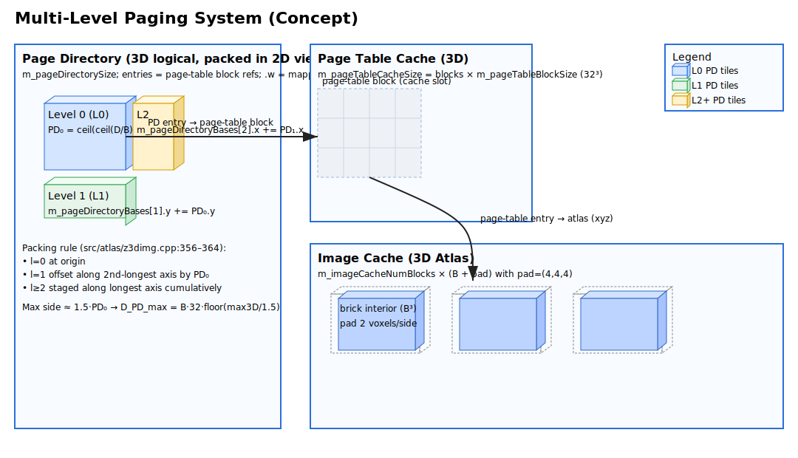
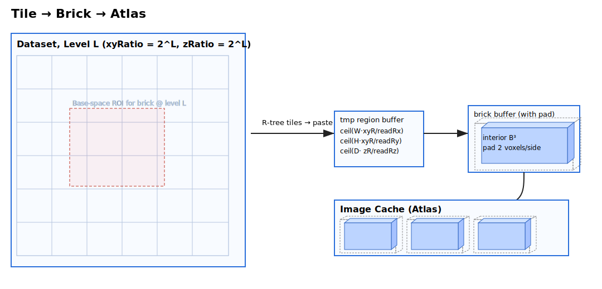
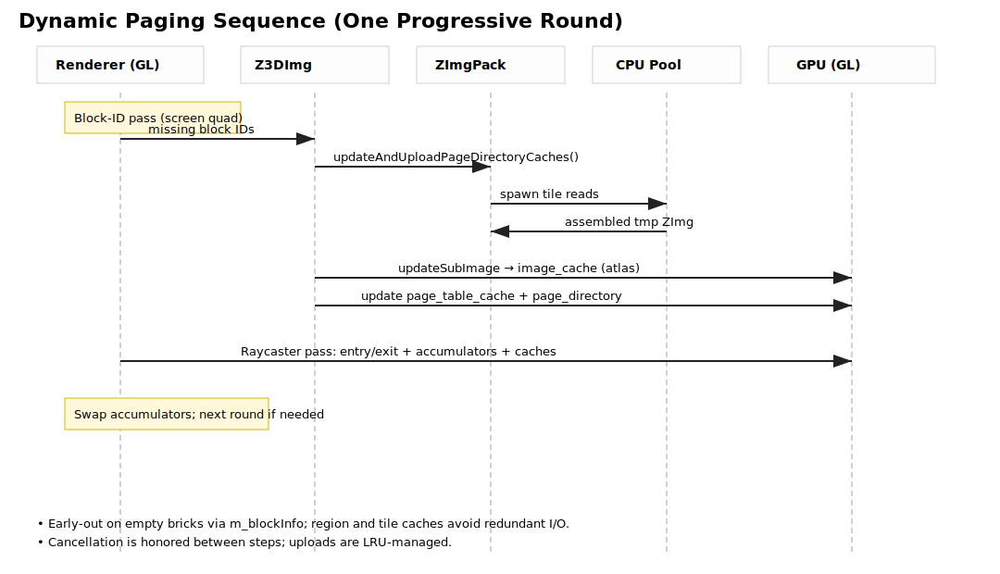

Atlas Image Paging & Progressive Volume Rendering

Overview

- Goal: Interactively visualize massive 3D images on commodity GPUs by treating the dataset as a virtual, multi‑resolution volume and paging only the on‑screen bricks to GPU memory.
- Technique:
  - Multi‑resolution brick pyramid (power‑of‑two in x/y/z) provides per‑pixel level‑of‑detail. The renderer chooses the coarsest level that matches the pixel footprint along the ray to minimize overdraw while preserving detail.
  - Demand paging via a lightweight GPU page‑directory + page‑table addressing scheme maps logical bricks to a compact 3D atlas texture with small padding to avoid seams. Unmapped bricks are discovered on the fly and queued for upload.
  - Progressive refinement: per‑pixel rays remember their resume state (accumulated color and ray length). Each round fills newly available bricks and continues integration without redoing completed work.
  - Multi‑channel support: channels render into layer arrays and are merged with depth‑aware, premultiplied compositing; MIP/Local‑MIP use a max‑projection merge path.
  - Deterministic invalidation and precise depth: alpha‑premultiplied outputs and explicit gl_FragDepth ensure stable blending across passes and with the compositor.
  - Scales beyond VRAM/RAM: working set is bounded by the visible bricks; background I/O uploads and LRU caching keep memory usage within budgets.

Scope

- This document details the Atlas image paging and progressive volume rendering pipeline across OpenGL and Vulkan backends, from ingesting images to progressive full‑resolution rendering. It focuses on the filter/renderers, image cache layout and updates, the block‑ID discovery pass, and how progressive rounds converge to a full‑resolution result.
- Relevant code: `src/atlas/` (filter, renderers, cache), `src/img/` and `src/atlas/zimgpack.*` (I/O and tile management), scratch resource pool, and shaders listed in `src/atlas/CMakeLists.txt`.

Quick Reference — Addressable Max Size (per axis)

| Block size flag | Interior B (= flag − 4) | D_ID_max (32-bit ID bound) | D_PD_max (page-dir bound) | Dominant |
| --- | ---:| ---:| ---:| --- |
| 64  | 60  | ≈ 93,284 | 2,620,800 | 32-bit ID |
| 128 | 124 | ≈ 192,787 | 5,416,320 | 32-bit ID |
| 256 | 252 | ≈ 391,793 | 11,007,360 | 32-bit ID |
| 512 | 508 | ≈ 789,805 | 22,189,440 | 32-bit ID |

Notes: D_ID_max ≈ B · c, where c = cbrt(((2^32 − 1) · 7)/8) ≈ 1,554.733553; D_PD_max = B · 32 · floor(2048/1.5) = B · 43,680.

Key Components

- Filter and renderers
  - `Z3DImgFilter` routes image rendering into opaque/transparent paths and manages parameters/cuts, progressive mode, and per‑eye targets.
    - File: src/atlas/z3dimgfilter.h:24
    - File: src/atlas/z3dimgfilter.cpp:1143
  - `Z3DImgRaycasterRenderer` renders volumes (and 2D images with transfer functions). Owns progressive state and entry/exit passes.
    - File: src/atlas/z3dimgraycasterrenderer.h:24
    - File: src/atlas/z3dimgraycasterrenderer.cpp:607
  - `Z3DImgSliceRenderer` renders explicit 2D plane slices sampled from 3D textures with colormaps.
    - File: src/atlas/z3dimgslicerenderer.h:17
    - File: src/atlas/z3dimgslicerenderer.cpp:256
  - `Z3DTextureAndEyeCoordinateRenderer` renders clipped volume faces to a 2‑layer entry/exit 2D array texture.
    - File: src/atlas/z3dtextureandeyecoordinaterenderer.h:8
    - File: src/atlas/z3dtextureandeyecoordinaterenderer.cpp:1
- Image and caches
  - `Z3DImg` manages per‑channel textures and the 3D paging cache (page directory, page table cache, image cache) for full‑resolution rendering.
    - File: src/atlas/z3dimg.h:31
    - File: src/atlas/z3dimg.cpp:1
  - `ZImgPack` provides tiled/pyramidal I/O, min/max, and async region reads used to populate cache bricks.
  - File: src/atlas/zimgpack.h:1
  - File: src/atlas/zimgpack.cpp:1
  - Large non‑pyramidal sources (>1GB) now default to index‑only pyramids. On open, no global min/max or downsampled images are built; instead, tile descriptors (512×512 XY tiles at powers‑of‑two ratios, Z=1) are precomputed without reading image data. Actual tile data is read on demand when tiles are displayed or used by paging. This eliminates long “open” stalls while preserving progressive 3D later. Feature flag: `--atlas_imgpack_defer_pyramidal`.
  - Quick window for float data: when full min/max is unavailable, Atlas samples a few base‑ratio tiles to estimate a percentile‑based display window (default 1%–99%). Flags: `--atlas_imgpack_quick_window_enable`, `--atlas_imgpack_quick_window_lower_p`, `--atlas_imgpack_quick_window_upper_p`, `--atlas_imgpack_quick_window_tiles_per_axis`, `--atlas_imgpack_quick_window_sample_step`, `--atlas_imgpack_quick_window_max_samples`.
- Scratch resources
  - `Z3DScratchResourcePool` leases FBOs/GPU images for block‑ID, entry/exit, layer arrays, and raycast accumulators.
    - File: src/atlas/z3dscratchresourcepool.h:1

Data Organization (ZImg & ZImgPack)

- ZImg (core image container)
  - Metadata: `ZImgInfo` stores `width`,`height`,`depth`,`numChannels`,`numTimes`, voxel type/size (`voxelFormat`,`bytesPerVoxel`,`validBitCount`), physical voxel sizes (`voxelSize*` + unit), channel names/colors, and timestamps.
    - Definitions and defaults: src/img/zimginfo.cpp:7, 140
  - Memory layout: contiguous per time frame with helpers `timeData`,`channelData`,`planeData`,`rowData`,`data(x,y,z,c,t)`. Copy loops in `crop(...)` reflect a row‑major `[t][c][z][y][x]` stride.
    - Crop implementation: src/img/zimg.cpp:765
  - Creation/wrapping: construct from `ZImgSource` (single file, list/sequence, multi‑scene) or wrap external memory (`wrapData(...)`) without copying; ownership flags avoid double‑free.
    - Wrapping: src/img/zimg.cpp:704, 723
  - Type/range utilities: `setVoxelFormat<T>()`, `dataRangeMin/Max<T>()`, and `validBitCount` to represent packed ranges.
    - Helpers: src/img/zimginfo.cpp:148, 182
  - Regions/transforms: `crop(ZImgRegion)`, `extractPlane/Row/Col/Voxel`, `resizedImg(...)`, conversions/normalize to 8/16‑bit or float for texture creation.
    - ROI ops: src/img/zimg.cpp:765, 941

- ZImgPack (pyramids, tiles, async I/O)
  - Purpose: organize large datasets into a multi‑resolution tile hierarchy with fast sub‑region reads and per‑block min/max.
  - Pyramidal ratios and tiling: base tile `m_tileSize=512`; `buildPyramidal()` fills `m_pyramidalRatios` and `m_allTiles`; map `m_rtToTileIndice` indexes tiles by `(xyRatio,zRatio,t)`; an R‑tree (`m_rtToTileBoxRTree`) accelerates spatial queries.
    - Structures: src/atlas/zimgpack.h:300–366
  - Async region reads: `readRegionToImgAsync(xyRatio,zRatio,sx,sy,sz,c,t,resInfo,displayMin,displayMax)` returns a shared ZImg aligned to requested ratios; `readTileToImgAsync(...)` supports per‑tile loading.
    - APIs: src/atlas/zimgpack.h:176, 190
  - Emptiness: `isEmptyBlock(...)` uses a concurrent map `m_blockInfo` from block key → (min,max) to quickly skip bricks whose max ≤ displayMin.
    - Check: src/atlas/zimgpack.h:212
  - Viewport helpers: `retrieveCoveredImgs`/`retrieveCoveredMIPImgs` select tiles intersecting a viewport at a scale and z/t; `needUpdate(...)` decides when to refresh.
    - APIs: src/atlas/zimgpack.h:124, 148, 170

readRegionToImgAsync — Semantics and Contract

- Purpose
  - Assemble a rectangular sub‑region of the dataset at a requested pyramid level into a contiguous `ZImg`, normalizing or converting intensities to the requested output format, with caching and early‑out for empty blocks.
  - Implementation: src/atlas/zimgpack.cpp:863
- Inputs
  - `xyRatio`, `zRatio` (≥1): requested downsample factors in XY and Z for this read, typically `m_levelScales[level].x` and `.z` from `Z3DImg`.
  - `sx`, `sy`, `sz`: region origin in the requested level’s voxel coordinates. In base (full‑res) coordinates, the read box is
    `[sx·xyRatio, (sx+W)·xyRatio) × [sy·xyRatio, (sy+H)·xyRatio) × [sz·zRatio, (sz+D)·zRatio)`, where `(W,H,D)=resInfo.(width,height,depth)`.
  - `sc`, `t`: channel and time index.
  - `resInfo`: desired output image description (dimensions and voxel type). For the paging pipeline, `(W,H,D)` usually equals the brick interior plus padding.
  - `displayRangeMin/Max`: used to normalize/convert intensities and to short‑circuit bricks known empty by threshold.
- Algorithm
  1) Emptiness and region cache
     - If `m_blockInfo` has maxIntensity for the exact key `(xyRatio,zRatio,sx,sy,sz,sc,t,W,H,D)` and `maxIntensity ≤ displayRangeMin`, return `nullptr` (empty brick).
     - If `ZImgRegionCache` has the assembled region for the exact key (including display range), return the cached `shared_ptr<ZImg>`.
     - Files: src/atlas/zimgpack.cpp:875, 906, 994
  2) Choose available pyramid ratio
     - Compute `readRatio = readRatioOf(xyRatio, xyRatio, zRatio)` to select the finest prebuilt pyramid not exceeding the requested ratios in any axis.
     - File: src/atlas/zimgpack.cpp:1432
  3) Tile query and assembly
     - Query the per‑ratio R‑tree for tiles intersecting the base‑space bbox `[sx·xyRatio, (sx+W)·xyRatio) × ...` at time `t`.
     - Allocate a temporary result `tmpResInfo` with dimensions `ceil(W·xyRatio/readRatio.x) × ceil(H·xyRatio/readRatio.y) × ceil(D·zRatio/readRatio.z)` at the source voxel type.
     - For each tile, load from `ZImgCache` and paste into the result at
       `start = round((tileCoord/ratio − s)·(xyRatio/readRatio))` per axis.
     - Files: src/atlas/zimgpack.cpp:912–934, 960–974
  4) Update blockInfo lazily
     - If the block key was not present, compute min/max over the assembled region and insert into `m_blockInfo`. If `max ≤ displayRangeMin`, return `nullptr`.
     - File: src/atlas/zimgpack.cpp:976–992
  5) Intensity mapping and resizing
     - If voxel type matches `resInfo` but display range or valid bits differ, call `normalize(displayMin,displayMax)`; otherwise convert to `resInfo` with `convertTo(...)`.
     - If assembled dimensions differ from `(W,H,D)`, resize with cubic interpolation (optional multithreaded path controlled by `--atlas_readRegionToImg_use_multithreaded_resize`).
     - Files: src/atlas/zimgpack.cpp:994–1020
  6) Insert into `ZImgRegionCache` and return the `shared_ptr<ZImg>`.
     - File: src/atlas/zimgpack.cpp:1026–1046
- Guarantees and notes
  - Returns `nullptr` when: no tiles intersect the query box, or the block is empty under the provided threshold.
  - Honors `folly::CancellationToken` at multiple checkpoints (before/after potentially long operations).
  - Reads run on the global CPU executor with coro `collectAll` across tiles; assembly is thread‑safe.
  - The returned image exactly matches `resInfo` dimensions and type; the pipeline passes `(W,H,D)=imageBlockExtent()` and `sx,sy,sz` offset by half padding so the atlas receives padded bricks.
  - Region and tile caches (`ZImgRegionCache`, `ZImgCache`) avoid redundant IO and assembly across frames.

Tile → Brick → Atlas (Diagram)

The following ASCII sketch shows how a requested brick region is assembled from ZImgPack tiles and written into the GPU image cache atlas via the page table mapping.

```
Dataset (pyramid levels)
  Level L (xyRatio = 2^L, zRatio = 2^L):
    +------------------------------+   +------------------------------+
    | 512×512 tiles over XY (per Z)| … | 512×512 tiles over XY (per Z)|
    +------------------------------+   +------------------------------+

Requested brick @ level L
  Base-space box:
    X: [sx·xyR, (sx+W)·xyR)
    Y: [sy·xyR, (sy+H)·xyR)
    Z: [sz· zR, (sz+D)· zR)

  ┌─────────────── query R-tree ────────────────┐
  │   Tiles intersecting the base-space box     │
  └────────────────────────┬────────────────────┘
                           │  paste at offsets rounded from
                           │  (tileCoord/ratio − s)·(requested/readRatio)
   assemble tiles → tmp ZImg (ceil(W·xyR/readRx) × ceil(H·xyR/readRy) × ceil(D·zR/readRz))
                           │ normalize/convert to output `resInfo`
                           │ resize to exact (W × H × D) if needed
                           ▼
                    Brick buffer (with pad)

Logical key (x,y,z,L) → PageTableEntry.xyz = atlas slot
                  └──> write brick via updateSubImage into `image_cache`
```

SVG Diagrams

- Multi‑Level Paging System: 
- Tile → Brick → Atlas: 
- Dynamic Paging Sequence: 


Image Management

- Source and scaling
  - Z3DImg wraps a `ZImgPack` source and determines an on‑GPU working resolution that respects hardware limits. 3D inputs are downsampled so each side ≤ 512 when needed; 2D uses `Z3DGpuInfo::getDataScaleForTexture(...)`.
    - Constructor and scaling: src/atlas/z3dimg.cpp:70
  - Effective working volume and spacing are recorded as `m_volumeDimension` and `m_volumeSpacing`. Downsampled status governs fast vs. progressive path.
- Channels and textures
  - Channels are capped by hardware limits (array layers). Per‑channel GL textures are created lazily in `channelTexture(...)` and use R8/R16/R32F to match source type.
    - Channel texture creation: src/atlas/z3dimg.cpp:195
  - GL resources can be released when switching backends and rebuilt on demand to keep memory usage stable.
    - Release GL paging: src/atlas/z3dimg.cpp:861
    - Rebuild GL paging: src/atlas/z3dimg.cpp:1396
- Paging caches
  - For downsampled volumes, the system initializes paging structures using concrete sizes:
    - Page‑table block: `m_pageTableBlockSize=(32,32,32)`; Brick pad: `m_imageBlockSizePad=(4,4,4)`; Interior brick size `B=(flag−4)`.
      - Declarations: src/atlas/z3dimg.h:317, src/atlas/z3dimg.h:320
    - Budgets scale with VRAM to size cache block counts for page‑table cache and image cache (bounded by 512 and 2048 side caps respectively).
      - Sizing and caps: src/atlas/z3dimg.cpp:371, 405
  - Level metadata (`m_levelScales`, `m_imageDimensions`, `m_pageTableDimensions`, `m_pageDirectoryDimensions`, `m_pageDirectoryBases`, `m_posToBlockIDs`) is computed in `setScale(...)`.
    - Level computation: src/atlas/z3dimg.cpp:240

Dynamic Block Construction & Eviction (On‑Demand Paging)

- Discovery
  - Block IDs are generated per frame by the slice or raycaster block‑ID shaders and deduplicated on CPU; `updateAndUploadPageDirectoryCaches(...)` consumes these IDs.
    - Entry point: src/atlas/z3dimg.cpp:550
- Mapping a block ID to cache actions
  1) Determine pyramid `level` from `m_posToBlockIDs` thresholds and compute `pageTableEntryKey=(x,y,z,level)`.
  2) Locate the page‑directory entry: `pageDirectoryEntryKey = pageTableEntryKey / m_pageTableBlockSize`, then `coord = m_pageDirectoryBases[level] + key.xyz`.
  3) Ensure the page‑table block is mapped. If unmapped, allocate an LRU slot via `insertPageTableBlockToCache(...)`, zero the corresponding region in the CPU page‑table array, and set the page‑directory entry to `(cachePos, 1)`.
     - Insert page‑table block: src/atlas/z3dimg.cpp:825
  4) Decide emptiness. Using `isImageBlockEmpty(...)`, test the brick region in the source at `(blockImagePos = pageTableEntryKey * m_imageBlockSize)`, expanded by half‑pad on each side. If empty, write `m_emptyPageTableEntry` to the page‑table entry and continue.
     - Emptiness check: src/atlas/z3dimg.h:286
  5) Stage non‑empty bricks as pending tasks. Async readers fetch brick data (with padding) via `ZImgPack::readRegionToImgAsync(...)` and upload to the atlas texture (`updateSubImage`). A PBO path is used when batches exceed a threshold.
     - Async read/upload path: src/atlas/z3dimg.cpp:1049
  6) Insert image blocks into the atlas LRU via `insertImageBlockToCache(...)`, which returns `(x,y,z)` coordinates. The corresponding page‑table entry is set to `(atlasPos, 1)`.
     - Insert image block: src/atlas/z3dimg.cpp:879
- Eviction bookkeeping
  - When a page‑table block is evicted by its LRU, the old page‑directory entry `.w` is reset to 0 and the CPU page‑table array region is zero‑filled.
    - Page‑table eviction handling: src/atlas/z3dimg.cpp:825
  - When an image block is evicted, its page‑table entry `.w` is cleared and the owner page‑directory `.w` (mapped‑brick count+1) is decremented.
    - Image‑block eviction handling: src/atlas/z3dimg.cpp:879
  - Cancellation or partial progress is reconciled by verifying and, if necessary, fixing `.w` counters in `checkPageSystemError(...)`.
    - Consistency check/repair: src/atlas/z3dimg.cpp:1360

High‑Level Flow

1) Ingest data and initialize image state
2) If rendering a volume: render entry/exit texture for clipped bounds
3) Choose fast vs full‑resolution mode:
   - Fast: Raycast the downsampled volume (or 2D) directly and (optionally) merge channels
   - Full‑res progressive: Discover needed bricks via a block‑ID pass, upload missing bricks into the 3D caches, then raycast per channel into a layered RT and merge; repeat rounds until converged
4) Composite into the filter’s per‑eye targets for the compositor

1) Image Ingest and Management

- `Z3DImgFilter::setData(...)` constructs a `Z3DImg` with channel display ranges; wires parameters; sets “Full Resolution Rendering” enabled only when the volume is downsampled.
  - File: src/atlas/z3dimgfilter.cpp:200
- `Z3DImg` computes downsample scales to meet GPU limits, per‑level scale factors, block and cache sizes, and memory budgets based on VRAM.
  - Downsample and cache sizing: src/atlas/z3dimg.cpp:30
  - Level scales and block ID mapping arrays (`m_levelScales`, `m_posToBlockIDs`, `m_imageDimensions`, `m_voxelWorldSizes`) computed in setScale(): src/atlas/z3dimg.cpp:256
- Per‑channel textures (GL) are created lazily on first use.
  - File: src/atlas/z3dimg.cpp:140
- Paging cache (GL) consists of:
  - Page Directory (3D RGBA32UI): maps page‑table blocks and counts mapped bricks: `m_channelPageDirectories` + texture
  - Page Table Cache (3D RGBA32UI): per‑block entry mapping into the image cache, or empty flag: `m_channelPageTableCaches` + texture
  - Image Cache (3D R8/R16/R32F): tiled brick atlas storing actual voxel bricks: `m_channelImageCacheTextures`
  - Managers: `Z3DBlockCache<glm::uvec4>` for page‑table blocks and image bricks handle LRU insert/evict and return atlas coordinates
  - Key sizing API: src/atlas/z3dimg.h:152 (pageDirectorySize), 156 (pageTableCacheSize), 162 (imageCacheSize), 166 (imageBlockSize)
- Releasing or rebuilding GL paging resources (on backend switches) is explicit to keep both backends stable.
  - Release GL: src/atlas/z3dimg.cpp:861
  - Rebuild GL: src/atlas/z3dimg.cpp:1396

2) Entry/Exit Pass (Raycaster only)

- For raycasting, the clipped volume surface is rendered twice into a 2‑layer 2D array texture (RGBA32F): back faces to layer 1 (exit), front faces to layer 0 (entry).
  - Prepare: `Z3DImgRaycasterRenderer::prepareEntryExit(...)`
  - File: src/atlas/z3dimgraycasterrenderer.cpp:1506
- Implementation uses `Z3DTextureAndEyeCoordinateRenderer` with culling toggled to generate entry and exit texels.
  - File: src/atlas/z3dtextureandeyecoordinaterenderer.cpp:1

3) Fast Path (Downsampled)

- Raycaster (single or multi‑channel):
  - `m_scRaycasterShader` binds entry/exit and volume + transfer function; for >1 channels, render per channel into a layer‑array RT and merge with `image2d_array_compositor.frag`.
  - Files: src/atlas/z3dimgraycasterrenderer.cpp:1486, 1626
- Slice renderer (plane slices with colormaps):
  - `m_scVolumeSliceShader` binds per‑channel volume + colormap; for >1 channels, render into a layer‑array RT and merge.
  - Files: src/atlas/z3dimgslicerenderer.cpp:386, 439

4) Full‑Resolution Progressive Path

When the volume is downsampled (`Z3DImg::isVolumeDownsampled()`), enabling “Full Resolution Rendering” switches to a progressive pipeline:

4.1) Block‑ID Pass (discover required bricks)

- Purpose: Find which bricks are traversed by rays for the current view, so they can be uploaded to the image cache.
- Slice of 3D:
  - Shader: `image3d_slice_with_transfun_blockID.frag`
  - Flow: for each visible channel, render current slice mesh into a single‑attachment `BlockId` RT (RGBA32UI), download IDs to CPU, deduplicate via TBB concurrent set, and filter out 0 and UINT_MAX sentinels.
  - Files: src/atlas/z3dimgslicerenderer.cpp:268, 304, 315
- 3D Raycaster:
  - Shader: `image3d_raycaster_blockID.frag`
  - Flow: render a screen‑quad pass using entry/exit and the last round accumulators to generate block IDs where rays still need refinement. The pool may provide multiple color attachments; the renderer reads back and merges them until enough unique IDs are collected or no progress is observed.
  - Files: src/atlas/z3dimgraycasterrenderer.cpp:1264, 1312, 1375

4.2) Upload Missing Bricks and Update Caches

- API: `Z3DImg::updateAndUploadPageDirectoryCaches(missingBlockIDs, c, cancellationToken, bt)`
  - File: src/atlas/z3dimg.cpp:518
- Algorithm outline:
  1) For each block ID, compute its level and pageTableEntryKey (x,y,z,w) using `m_posToBlockIDs` and level thresholds.
  2) If the page table block is not mapped: allocate it (LRU) via `insertPageTableBlockToCache`, zero its entries, update the page directory entry and count. File: src/atlas/z3dimg.cpp:825
  3) If the brick is empty by threshold (`isEmptyBlock`), mark the page table entry as `m_emptyPageTableEntry`.
  4) Otherwise, stage a pendingTask for the brick.
  5) Read bricks async via `ZImgPack::readRegionToImgAsync(...)` and upload:
     - Queue‑based async path (default) copies CPU results to `updateSubImage` directly
       - Files: src/atlas/z3dimg.cpp:1116, 1159
     - PBO path (optional for large batches) maps a GL pixel buffer and copies once before per‑brick `updateSubImage`
       - Files: src/atlas/z3dimg.cpp:1196, 1230
  6) Invalidate/evict victims: `insertImageBlockToCache` updates the page table entry to point at the new atlas position; evicted bricks clear their page table entry and decrement the owning page directory counter
     - File: src/atlas/z3dimg.cpp:879
  7) Upload updated page directory and page table caches to GPU textures if any changes occurred
     - File: src/atlas/z3dimg.cpp:740
 8) Validate invariants; fix soft inconsistencies after cancellations
     - `checkPageSystemError(...)`: src/atlas/z3dimg.cpp:1296

Dynamic Paging Sequence (Diagram)

The sequence below sketches one progressive round from discovery to rendering. Solid arrows denote calls; dashed denote data.

```
Renderer(GL)        Z3DImg                 ZImgPack             CPU Pool                GPU
    |                 |                      |                     |                      |
    | Block-ID pass   |                      |                     |                      |
    |<-- IDs (CPU) ---|                      |                     |                      |
    | updateAndUploadPageDirectoryCaches()   |                     |                      |
    |---------------->|  for each ID:        |                     |                      |
    |                 |  ensure page-table   |                     |                      |
    |                 |  block (LRU map)     |                     |                      |
    |                 |-- empty? mark+skip --|                     |                      |
    |                 |  co_await readRegionToImgAsync(xyR,zR,sx,sy,sz,sc,t,resInfo,DR)  |
    |                 |---------------------->|  pick readRatio;   |                      |
    |                 |                      |  query R-tree      |                      |
    |                 |                      |-- spawn tile tasks ----->(parallel)        |
    |                 |                      |<- assemble tmp ZImg -----(join)----------- |
    |                 |<----- shared<ZImg> ---|                     |                      |
    |                 |  upload updateSubImage to image_cache ---------------------------> |
    |                 |  update page table + directory ---------------------------------> |
    |<----------------|  return when all IDs handled                                      |
    | Raycaster pass (uses entry/exit, last accumulators, caches) ----------------------> |
    | Swap accumulators; continue until rays complete                                     |
```

Cache Structures and Semantics

- Page Directory (3D RGBA32UI per channel)
  - xyz: origin of the mapped page‑table block inside the page table cache
  - w: 0 (unmapped); 1..N (#mapped bricks + 1); `m_emptyFlag` for “empty page directory region” (rare, not yet used)
- Page Table Cache (3D RGBA32UI per channel)
  - xyz: origin of the mapped brick inside the image cache texture
  - w: 0 (unmapped); 1 (mapped); `m_emptyFlag` (brick known empty by min threshold)
- Image Cache (3D R8/R16/R32F per channel)
  - Stores bricks with padding (`m_imageBlockSizePad`) to avoid filter artifacts
- Managers (`Z3DBlockCache<glm::uvec4>`) provide LRU mapping from logical keys (page table keys or brick keys) to cache positions in their respective atlases.

Raycaster Progressive Accumulation (3D)

- State: per eye `m_channelIdx[eye]`, `m_round[eye]`, and `m_progressiveLayerLease` for intermediate multi‑channel images. Ping‑pong accumulators (`m_lastRaycastAccum` and `m_currentRaycastAccum`) store last color/depth and current outputs for iterative refinement.
  - File: src/atlas/z3dimgraycasterrenderer.h:128
- First progressive call shows a fast result and initializes state; returns ~0.5 progress to the engine.
  - File: src/atlas/z3dimgraycasterrenderer.cpp:1000
- Each round:
  - Discover bricks, upload missing ones, then render the active channel using `m_image3DRaycasterShader` with:
    - Entry/exit texture (layer 0/1)
    - Last color (accumulator 0) and last ray depth (accumulator 1)
    - Page directory/table and image cache bound
    - Transfer function for that channel
  - Swap accumulators and advance round/channel via `finalizeProgressiveRound()`
  - Files: src/atlas/z3dimgraycasterrenderer.cpp:1352, 1416
- Convergence:
  - If block‑ID readback contains only zeros (no outstanding bricks), `lastRound` is true and the channel converges. The renderer advances to the next visible channel or completes if none remain.

Slice Progressive Accumulation (2D Slices from 3D)

- First progressive call renders a fast slice and reports 0.5 progress.
  - File: src/atlas/z3dimgslicerenderer.cpp:256
- For each channel, run block‑ID, upload missing bricks, then draw slices with `image3d_slice_with_colormap.frag` or transfer‑function equivalent. Merge if multi‑channel.
  - Files: src/atlas/z3dimgslicerenderer.cpp:268, 320, 372

Block‑ID Encoding and Mapping

- Shaders emit a 32‑bit logical block ID per pixel; the CPU maps this ID to (x,y,z,level) with `m_posToBlockIDs[level]` and per‑level dimensions, then to a page‑table entry key.
- Uniforms for block‑ID and render shaders include:
  - `page_directory_bases`, `page_table_block_size`, `image_dimensions[level]`, `voxel_world_sizes[level]`, `image_block_size`, `pos_to_block_ids[level]`
  - For render: `image_address_to_normalized_texture_coord` and bound textures `page_directory`, `page_table_cache`, `image_cache`, and the base `volume`
  - Files: src/atlas/z3dimg.cpp:518, 531

Scratch Pool Usage

- All heavy render targets are acquired via `Z3DScratchResourcePool` and returned automatically when RAII leases go out of scope or are explicitly `release()`d.
  - Block‑ID RT: `acquireBlockIdRenderTarget(...)` (RGBA32UI attachments)
  - Entry/exit RT: `acquireEntryExitRenderTarget(...)` (2‑layer RGBA32F array)
  - Layer array RT: `acquireLayerArrayRenderTarget(...)` (color+depth arrays)
  - Raycast accumulators: `acquireRaycastAccumulatorRenderTarget(...)` (color + ray depth)
  - File: src/atlas/z3dscratchresourcepool.h:260
- Filter‑owned per‑eye outputs (opaque/transparent) are also leased from the pool and preserved until copied by the compositor.
  - Files: src/atlas/z3dimgfilter.cpp:960, 1440

Threading and Cancellation

- Rendering runs on the rendering thread; all GL work must occur on that thread (single context). CPU brick reads fan out to the global CPU thread pool and communicate results via async queues or coroutines.
- Long operations honor `folly::CancellationToken` so interactive changes can cancel progressive uploads and subsequent rounds.
  - Files: src/atlas/z3dimg.cpp:462, 1116; src/atlas/z3dimgraycasterrenderer.cpp:650

Invariants and Error Handling

- Fatal invariants (`CHECK`) protect assumptions across the engine:
  - Non‑null textures when binding
  - Size/format contracts for attachments
  - Valid mapping ranges and cache structure consistency (`checkPageSystemError`)
- Benign skips (e.g., no visible rendering, empty geometry) return early without crashing.

Tuning and Flags

- `--atlas_image_block_size`: brick dimension (64 default; supports 128/256/512); pad added internally to avoid seams
- `--atlas_volume_rendering_maximum_round`: limit progressive raycaster rounds
- `--atlas_number_of_blocks_to_use_PBO_threashold`: threshold to switch to PBO upload path
- Device VRAM determines image/page cache memory budgets (see constructor in `Z3DImg`).

End‑to‑End: Z3DImgFilter Process()

- `Z3DImgFilter::process(eye)` orchestrates:
  1) Sync and optionally reset renderer progressive state on invalidation
  2) If an image is present, render via raycaster (fast or progressive)
  3) If slices are enabled, render slices (fast or progressive)
  4) Copy results from internal leases to the compositor via `Z3DTextureCopyRenderer`
  - Files: src/atlas/z3dimgfilter.cpp:854, 1125, 1440, 480

GPU‑Side Computation Details

This section details the per‑shader GPU computations and how they integrate into the pipeline above. It consolidates shader behavior, inputs/outputs, and the progressive loop.

Conventions

- Color writes use premultiplied alpha (rgb scaled by a) unless forced opaque.
- Depth mapping uses ze↔zw transforms with uniforms `ze_to_zw_a`, `ze_to_zw_b`: zw = a/ze + b.
- Transfer functions/colormaps are sampled by scalar voxel intensity in [0,1]. On OpenGL they are 1D textures; on Vulkan they are 2D Nx1 textures for MoltenVK/Metal portability.
- Progressive raycasting uses a color target and a ray‑state target (ray length and resolved depth). Completed rays mark length=1.
- Full‑res paging uses a page directory and page table cache (RGBA32UI) to address into an image cache atlas (R8/R16/R32F).

Entry/Exit Generation (ray endpoints)

- Vertex transforms positions and forwards 3D texcoords and eye‑space z.
  - src/atlas/Resources/shader/transform_with_3dtexture_and_eye_coordinate.vert:1
- Fragment writes `vec4(texCoord, eyeCoord.z)`.
  - src/atlas/Resources/shader/render_3dtexture_coordinate_and_eye_coordinate.frag:1
- Renderer draws back faces to layer 1 (exit), then front faces to layer 0 (entry) of a 2‑layer RGBA32F array.
  - src/atlas/z3dimgraycasterrenderer.cpp:1211

Fast Raycaster (downsampled, single‑channel shader)

- Performs front‑to‑back ray marching through a monolithic 3D `volume_1`.
  - src/atlas/Resources/shader/volume_raycaster_single_channel.frag:1
- Inputs: entry/exit, `volume_1`, `volume_dimensions_1`, `transfer_function_1`, `sampling_rate`, optional `iso_value`, `local_MIP_threshold`, and `ze_to_zw_*`.
- Computation: compute step from major axis; sample scalar; map via TF; scale alpha by 1/sampling_rate; composite via defined mode:
  - DVR: front‑to‑back alpha compositing with early termination at a≥1.
  - ISO: first sample near iso_value becomes a hard hit; resolves depth at that t.
  - XRay: additive accumulation.
  - MIP/LOCAL_MIP: track max scalar (optional local threshold early‑finish); TF applied to the max at the end.
- Depth: derived from entry/exit ze at the resolved hit; else opaque uses entry depth, transparent uses far (1.0).
- Binding: src/atlas/z3dimgraycasterrenderer.cpp:1486, 1626

Full‑Resolution Progressive Raycaster (paged bricks)

- Marches a ray using per‑block paging; reads from the atlas (`image_cache`) when mapped; yields partial progress when encountering UNMAPPED data.
  - src/atlas/Resources/shader/image3d_raycaster.frag:1
- Inputs
  - Entry/exit: `ray_entry_exit_tex_coord` (layer 0/1).
  - Accumulators from last round: `last_color` (premultiplied) and `last_ray_depth` (current length, resolved depth or <0).
  - Paging: `page_directory`, `page_table_cache`, `page_directory_bases[level]`, `page_table_block_size`, `image_dimensions[level]`, `image_block_size`, `image_cache`, `image_address_to_normalized_texture_coord`.
  - LOD: `voxel_world_sizes[level]`, `ze_to_screen_pixel_voxel_size` to choose a level matching the pixel footprint.
  - TF: `transfer_function` for the active channel, `sampling_rate`, optional `iso_value` and `local_MIP_threshold`.
- Algorithm
  - Initialize from previous pass; if first pass, `rayDepth = -1` (unresolved).
  - Choose pyramid level via desired voxel size along the ray.
  - Step size = 1/(sampling_rate*max(|Δ|)*dims[level]).
  - For non‑terminal levels: per‑block traversal
    - Compute `voxelCoord` and `pageTableCoord = voxelCoord / image_block_size`.
    - Fetch page directory at `page_directory_bases[level] + pageTableCoord / page_table_block_size`.
    - If mapped: fetch page table entry; if mapped and not empty, sample within that brick until leaving the block:
      - Atlas address = `entry.xyz + (voxelCoord % image_block_size) + frac + 2.0` (padding) → `image_cache` sample.
      - Composite (DVR/ISO/XRAY/MIP) with alpha scaled by 1/sampling_rate; advance `currentRayLength` by step.
    - If UNMAPPED: set `hitMissedBlock = true` to end the pass for CPU upload.
    - If EMPTY: skip ahead to the next block boundary.
  - Terminal level: sample monolithic `volume` directly with the same compositing logic.
  - Finish
    - UNMAPPED: output partial color and `FragData1 = (currentRayLength, rayDepth, 0, 1)`; resume next round.
    - Completed: premultiplied color to `FragData0`, and `FragData1=(1.0, resolvedDepth, 0, 1)`.
- Binding & rounds: src/atlas/z3dimgraycasterrenderer.cpp:1337, 1352, 1371, 1381, 1392, 1416

Block‑ID Discovery (raycaster path)

- Emits up to 32 logical block IDs per pixel (8 uvec4 MRT) to drive CPU brick uploads.
  - src/atlas/Resources/shader/image3d_raycaster_blockID.frag:1
- Traversal mirrors the progressive ray LOD/step logic; collects IDs when page directory/table is UNMAPPED or MAPPED‑but‑needed; skips EMPTY.
- Binding & readback: src/atlas/z3dimgraycasterrenderer.cpp:1277, 1303

Slice From 3D (paged)

- Transfer‑function slice: page lookup per pixel → sample cache → TF.
  - src/atlas/Resources/shader/image3d_slice_with_transfun.frag:1
- Colormap slice: same page lookup, then Nx1 2D colormap.
  - src/atlas/Resources/shader/image3d_slice_with_colormap.frag:1
- Inputs: page directory/table/cache, `image_dimensions`, `image_block_size`, `image_address_to_normalized_texture_coord`, `voxel_world_sizes`, `ze_to_screen_pixel_voxel_size`, and TF/colormap.
- LOD: chosen from eye‑space pixel footprint (`eyeCoord.z * ze_to_screen_pixel_voxel_size`). Terminal level samples the monolithic `volume`.
- Block‑ID variant writes the linearized block ID on UNMAPPED or mapped‑but‑needed.
  - src/atlas/Resources/shader/image3d_slice_with_transfun_blockID.frag:1
- Binding (GL): src/atlas/z3dimgslicerenderer.cpp:313, 335, 350, 402

2D Image Paths

- 2D + TF: sample red from `sampler2D` then TF; premultiply; optionally force opaque.
  - src/atlas/Resources/shader/image2d_with_transfun_single_channel.frag:1
- 2D + colormap: sample red then Nx1 2D LUT; premultiply.
  - src/atlas/Resources/shader/image2d_with_colormap_single_channel.frag:1

Layer Array Compositor (merge multi‑channel)

- Merges per‑channel color/depth layers into a single output using premultiplied alpha. Supports MAX_PROJ_MERGE for MIP.
  - src/atlas/Resources/shader/image2d_array_compositor.frag:1
- Usage: after drawing each channel slice/raycast into a layer array RT, sort/merge or max‑merge.
  - src/atlas/z3dimgraycasterrenderer.cpp:1579, 1664; src/atlas/z3dimgslicerenderer.cpp:369, 457

Two‑Input Compositor (mix two streams)

- Combines two color+depth textures with depth‑test or “first/second on top”, including a MIP‑friendly depth‑test with premultiplied blending.
  - src/atlas/Resources/shader/compositor.frag:1

Copy Completed Rays (progressive finalize)

- Copies only pixels whose rays completed (ray length==1), writing the resolved depth to gl_FragDepth.
  - src/atlas/Resources/shader/copy_raycaster_image.frag:1

Paging Data Structures (GL)

- Page Directory (`usampler3D RGBA32UI`): tiles of page‑table blocks; `.w` UNMAPPED/EMPTY; `.xyz` base of page‑table block.
- Page Table Cache (`usampler3D RGBA32UI`): per‑brick entries; `.w` state; `.xyz` base in `image_cache`.
- Image Cache (`sampler3D`): brick atlas of scalar voxels; normalized by `image_address_to_normalized_texture_coord`; padded (+2.0) to avoid seams.
- Level metadata: `image_dimensions[level]`, `image_block_size`, `voxel_world_sizes[level]`, `page_table_block_size`, `page_directory_bases[level]`, `pos_to_block_ids[level]`.
- CPU uploads between progressive rounds update these textures.
  - C++: src/atlas/z3dimg.cpp:1; bindings in renderers: src/atlas/z3dimgraycasterrenderer.cpp:1337, 1371; src/atlas/z3dimgslicerenderer.cpp:313

Numerical Details and Invariants

- Step size stability: DVR alpha scaled by 1/sampling_rate to keep integration stable across sample counts.
- LOD choice: per‑fragment level by on‑screen voxel footprint to minimize overdraw while preserving detail.
- Early exit: terminate on alpha saturation (DVR), threshold (LOCAL_MIP), or UNMAPPED (progressive resume).
- Depth resolution: interpolate between entry/exit ze at first hit; otherwise opaque uses entry depth, transparent uses far.
- Premultiplication: all color outputs premultiply rgb by alpha; compositors assume this.
- Safety: clamp voxel coords at brick edges; skip EMPTY regions; treat UNMAPPED as “request and resume later”.

Maximum Addressable Image Size

This section derives the theoretical upper bound on volume dimensions that the paging system can address, independent of GPU RAM, using the concrete parameters in code.

- Fixed parameters (GL path)
  - Page‑table block size: `m_pageTableBlockSize = (32,32,32)` (src/atlas/z3dimg.h:317)
  - Brick padding: `m_imageBlockSizePad = (4,4,4)` → 2‑voxel border each side (src/atlas/z3dimg.h:320)
  - Configurable brick nominal edge: `--atlas_image_block_size ∈ {64,128,256,512}`; effective interior brick size is
    `B = (--atlas_image_block_size) − 4` (src/atlas/z3dimg.cpp:47, 68)
  - Max 3D texture side used for page‑directory: `Z3DGpuInfo::max3DTextureSize() = min(2048, GL_MAX_3D_TEXTURE_SIZE)`
    (src/atlas/z3dgpuinfo.h:82, src/atlas/z3dgpuinfo.cpp:274)
  - Page‑table cache side limit used in sizing: 512 (src/atlas/z3dimg.cpp:371)
  - Image‑cache side limit used in sizing: 2048 (src/atlas/z3dimg.cpp:405)
  - Block‑ID space: 32‑bit unsigned across all levels (shaders/CPU use `uint32_t`) (src/atlas/Resources/shader/image3d_raycaster_blockID.frag:1, src/atlas/z3dimg.cpp:575)

Two independent constraints bound the maximum image size D (voxels per axis, assuming cubic/isotropic for clarity):

1) Page‑Directory Texture Bounds (addressability per level)
- Level‑0 page‑directory dims per axis are: `PD0 = ceil( ceil(D / B) / 32 )`.
- Levels are packed across axes (src/atlas/z3dimg.cpp:342–364). For isotropic data the largest axis becomes roughly `PD0 + PD1 ≈ PD0 + PD0/2 = 1.5·PD0` after packing all levels.
- To fit within the 3D texture side limit `T = 2048`, require `1.5·PD0 ≤ T` → `PD0 ≤ floor(T/1.5) = 1365`.
- Therefore, `D_PD_max = B · 32 · 1365`.
  - With default `--atlas_image_block_size=64` → `B=60` → `D_PD_max = 60 · 32 · 1365 = 2,620,800` voxels per axis.

2) 32‑bit Block‑ID Space (global across all levels)
- Number of bricks at level l: approximately `(D / (B·2^l))^3`. Total bricks across all levels sum geometrically:
  `N_total ≈ (D/B)^3 · (1 + 1/8 + 1/64 + …) = (D/B)^3 · (8/7)`.
- Shaders/CPU encode block IDs as 32‑bit unsigned, so require `N_total ≤ 2^32 − 1`.
- Solving for D: `D_ID_max ≈ B · cbrt(((2^32 − 1) · 7)/8)`.
  - The constant `c = cbrt(((2^32 − 1) · 7)/8) ≈ 1,554.733553`.
  - With `B=60` → `D_ID_max ≈ 60 · 1,554.733553 ≈ 93,284` voxels per axis.

Which constraint dominates?
- For practical datasets, the 32‑bit Block‑ID limit is far tighter than the page‑directory texture limit. With default settings, the maximum addressable cubic volume is on the order of 93k³ voxels.

Results by block size (padding is always 4, so `B = block − 4`)
- `block=64  → B=60`:  `D_ID_max ≈ 93,284`, `D_PD_max = 2,620,800` → effective max ≈ 93k per axis.
- `block=128 → B=124`: `D_ID_max ≈ 192,787`,  `D_PD_max = 5,416,320` → effective max ≈ 193k per axis.
- `block=256 → B=252`: `D_ID_max ≈ 391,793`,  `D_PD_max = 11,007,360` → effective max ≈ 392k per axis.
- `block=512 → B=508`: `D_ID_max ≈ 789,805`,  `D_PD_max = 22,189,440` → effective max ≈ 790k per axis.

Notes
- These are theoretical addressability limits. Actual memory residency is governed by the cache budgets that adapt to GPU VRAM (src/atlas/z3dimg.cpp:77–119), but paging allows rendering sub‑regions progressively regardless of dataset size up to these bounds.
- The page‑directory packing across axes ensures `~1.5×` overhead on the longest dimension for isotropic data; highly anisotropic data may shift which axis saturates first, but the 32‑bit Block‑ID bound remains the dominant constraint.

Derivation Sidebar — 1.5× Page‑Directory Packing

- For isotropic data, level‑l image dimensions shrink by ~2^l per axis. The per‑level page‑directory size is
  `PD_l = ceil( ceil(D / (B·2^l)) / 32 )` (src/atlas/z3dimg.cpp:338–342).
- We place page‑directory tiles for different pyramid levels along different axes (src/atlas/z3dimg.cpp:356–364):
  - l=0 at origin.
  - l=1 shifted along the second‑longest axis by `PD_0`.
  - l≥2 staged along the longest axis, each offset by the previous level’s extent along that axis (cumulative).
- Y‑axis extent: `PD_0 + PD_1 = PD_0 + PD_0/2 = 1.5·PD_0` dominates because later levels contribute less (`PD_2 = PD_0/4`, etc.) at the same Y offset.
- X‑axis extent: `max(PD_0, PD_1 + PD_2 + … + PD_L)` where the sum converges to `PD_0` (geometric 1/2 series). Thus X remains ≤ `PD_0`.
- Z‑axis extent remains ≤ `PD_0` as no inter‑level offset accumulates there in the packing scheme.
- Therefore the maximal per‑axis page‑directory side is ~`1.5·PD_0`, yielding `D_PD_max = B · 32 · floor(max3DTextureSize / 1.5)` with the GL cap checked at src/atlas/z3dimg.cpp:365–367.

Practical Tips

- Keep output sizes consistent across collaborating renderers to avoid churn.
- Release entry/exit leases when a progressive session ends (`renderImage` returns 1.0) to free pool capacity.
- Use `--v=1` to trace block‑ID discovery, upload timing, and round progression.

Glossary

- Entry/Exit Texture: 2‑layer 2D array (entry=layer 0, exit=layer 1) holding ray start/end positions
- Page Directory: Coarse mapping from image regions to page table cache locations; counts mapped bricks
- Page Table Cache: Fine mapping from brick logical coordinates to image cache atlas positions; supports “empty” flag
- Image Cache: 3D atlas of actual bricks stored in a GL texture
- Block‑ID Pass: Shader pass that encodes logical brick IDs per pixel to guide brick uploads
