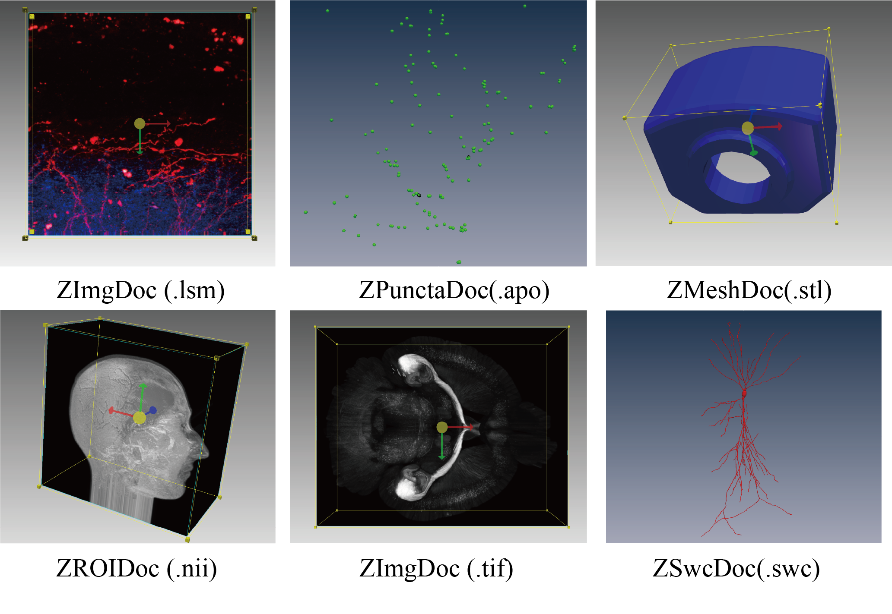
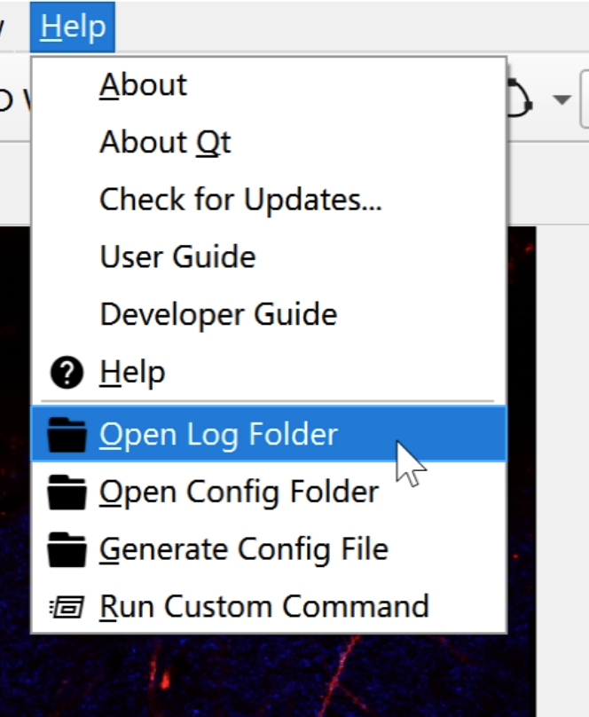
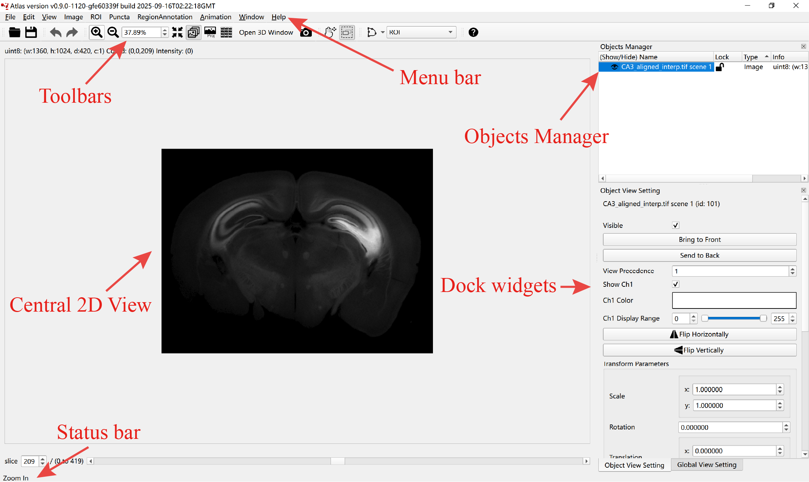
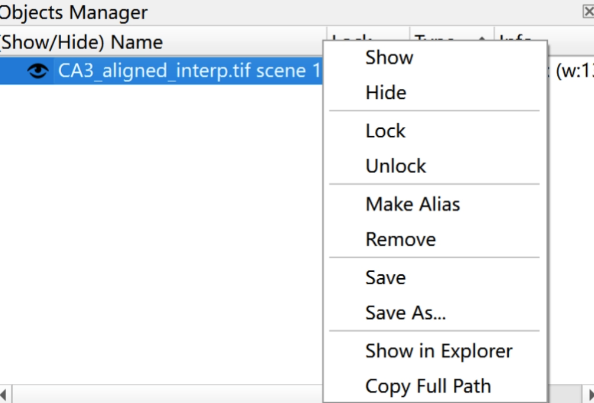
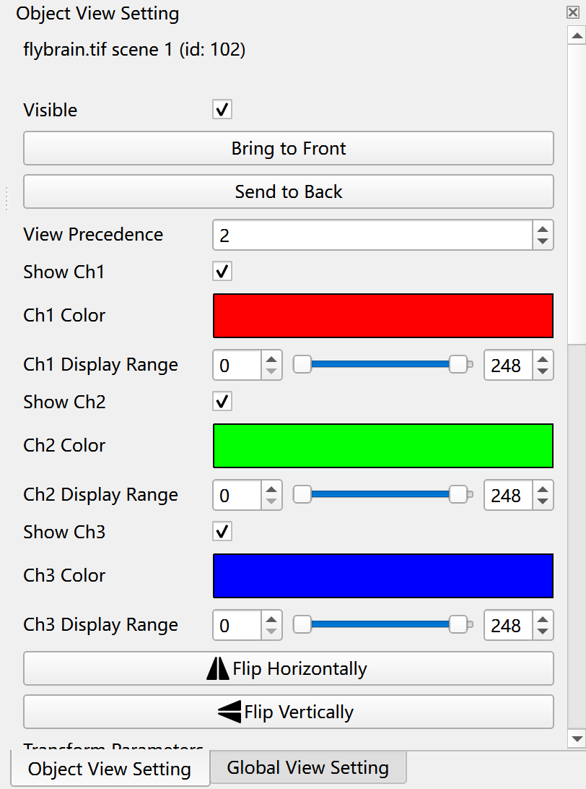
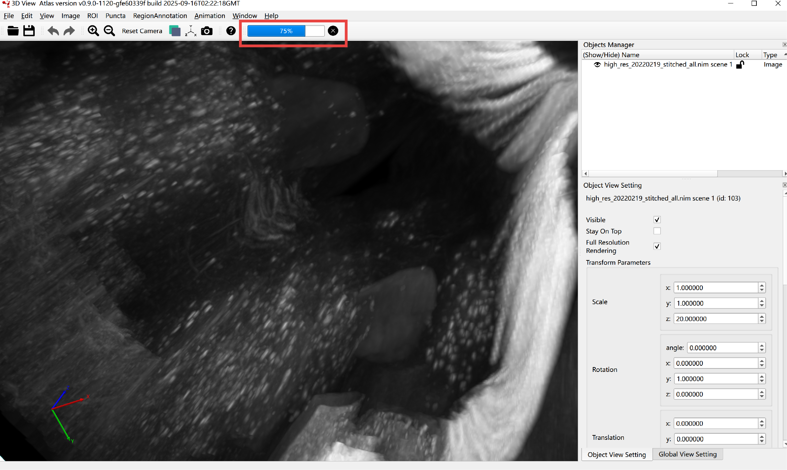
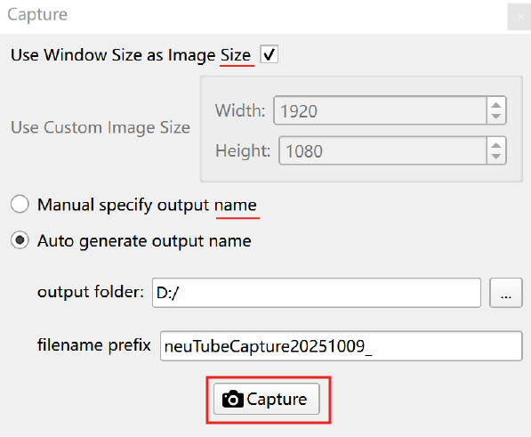
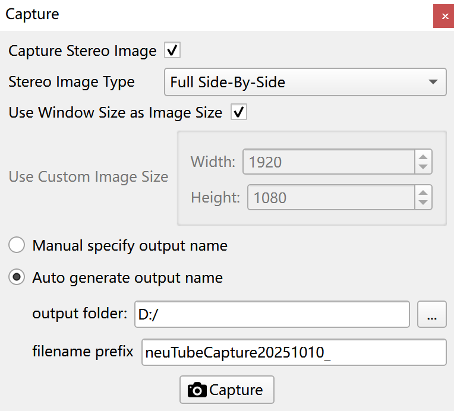
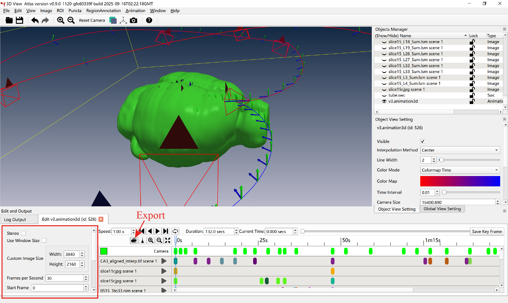
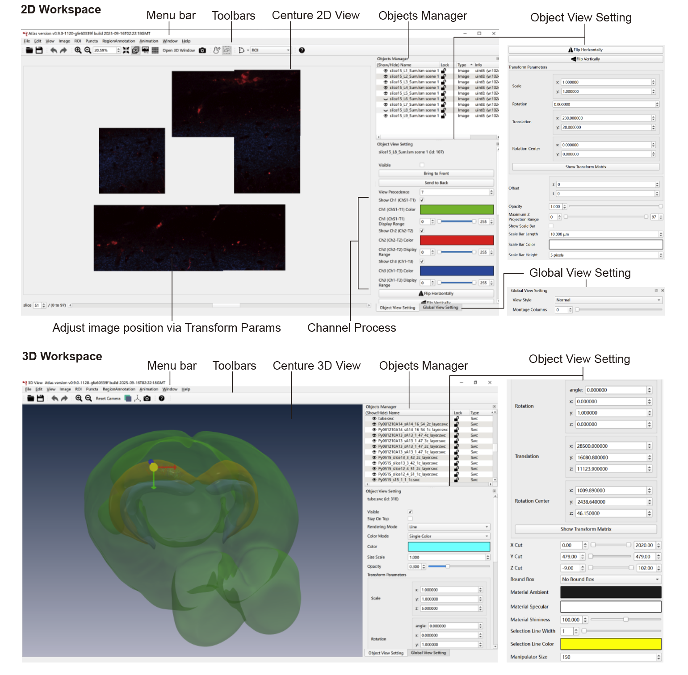

Atlas User Guide
================
<!-- > 📸 **Screenshot to add:** Application splash or title screen that introduces Atlas. Include version number in the window title.-->

## Table of Contents
- [1. Introduction](#1-introduction)
  - [1.1 What Atlas Does](#11-what-atlas-does)
  - [1.2 System Requirements](#12-system-requirements)
  - [1.3 Supported Data Types](#13-supported-data-types)
  - [1.4 How This Guide Is Organized](#14-how-this-guide-is-organized)
- [2. Getting Atlas Ready](#2-getting-atlas-ready)
  - [2.1 Building or Installing](#21-building-or-installing)
  - [2.2 First Launch Checklist](#22-first-launch-checklist)
  - [2.3 Understanding the Atlas File Layout](#23-understanding-the-atlas-file-layout)
- [3. Guided Tour of the Interface](#3-guided-tour-of-the-interface)
  - [3.1 2D Main Window at a Glance](#31-2d-main-window-at-a-glance)
  - [3.2 Menus in Detail](#32-menus-in-detail)
  - [3.3 Toolbars and Quick Controls](#33-toolbars-and-quick-controls)
  - [3.4 Dock Widgets](#34-dock-widgets)
  - [3.5 Status Bar and Notifications](#35-status-bar-and-notifications)
  - [3.6 Customizing Your Workspace](#36-customizing-your-workspace)
- [4. Working with Data Objects](#4-working-with-data-objects)
  - [4.1 The Object Lifecycle](#41-the-object-lifecycle)
  - [4.2 Images](#42-images)
  - [4.3 Region of Interest (ROI) Masks](#43-region-of-interest-roi-masks)
  - [4.4 Region Annotations](#44-region-annotations)
  - [4.5 Puncta Sets](#45-puncta-sets)
  - [4.6 SWC Trees](#46-swc-trees)
  - [4.7 Meshes](#47-meshes)
  - [4.8 SVG Overlays](#48-svg-overlays)
  - [4.9 2D Animations](#49-2d-animations)
  - [4.10 3D Animations](#410-3d-animations)
  - [4.11 Alias Objects](#411-alias-objects)
- [5. 2D Workspace Skills](#5-2d-workspace-skills)
  - [5.1 Navigation Fundamentals](#51-navigation-fundamentals)
  - [5.2 View Styles and Slicing](#52-view-styles-and-slicing)
  - [5.3 ROI Authoring Tools](#53-roi-authoring-tools)
  - [5.4 Selection, Copy, and Paste](#54-selection-copy-and-paste)
  - [5.5 The Edit and Output Dock](#55-the-edit-and-output-dock)
  - [5.6 Logging View Changes](#56-logging-view-changes)
  - [5.7 Interactive Tracing](#57-interactive-tracing)
  - [5.8 Automatic Tracing and Background Tasks](#58-automatic-tracing-and-background-tasks)
- [6. 3D Workspace Skills](#6-3d-workspace-skills)
  - [6.1 Opening and Reusing the 3D Window](#61-opening-and-reusing-the-3d-window)
  - [6.2 Camera Navigation](#62-camera-navigation)
  - [6.3 Object View Settings in 3D](#63-object-view-settings-in-3d)
  - [6.4 Global View Settings in 3D](#64-global-view-settings-in-3d)
  - [6.5 Background, Axis, and Shortcuts Reference](#65-background-axis-and-shortcuts-reference)
  - [6.6 The Progress Toolbar and Rendering Queue](#66-the-progress-toolbar-and-rendering-queue)
- [7. Scene Management](#7-scene-management)
  - [7.1 Saving Your Workspace](#71-saving-your-workspace)
  - [7.2 Loading Scenes Step by Step](#72-loading-scenes-step-by-step)
  - [7.3 Troubleshooting Scene Loads](#73-troubleshooting-scene-loads)
- [8. Capture and Export](#8-capture-and-export)
  - [8.1 2D Screenshots](#81-2d-screenshots)
  - [8.2 3D Screenshots](#82-3d-screenshots)
  - [8.3 3D Animation Export in the GUI](#83-3d-animation-export-in-the-gui)
  - [8.4 Headless 3D Animation Export](#84-headless-3d-animation-export)
  - [8.5 Headless 3D Scene Export](#85-headless-3d-scene-export)
- [9. Workflow Recipes](#9-workflow-recipes)
  - [9.1 Explore a New Dataset](#91-explore-a-new-dataset)
  - [9.2 Create and Refine ROIs with a Mask Image](#92-create-and-refine-rois-with-a-mask-image)
  - [9.3 Build a 3D Animation for Presentation](#93-build-a-3d-animation-for-presentation)
  - [9.4 Generate High-Resolution Stereo Captures](#94-generate-high-resolution-stereo-captures)
  - [9.5 Batch Export Animations via CLI](#95-batch-export-animations-via-cli)
- [10. Configuration, Logs, and Maintenance](#10-configuration-logs-and-maintenance)
  - [10.1 Configuration Files and Flags](#101-configuration-files-and-flags)
  - [10.2 Log Files and Diagnostics](#102-log-files-and-diagnostics)
  - [10.3 Updating and Multiple Instances](#103-updating-and-multiple-instances)
- [11. Troubleshooting and FAQ](#11-troubleshooting-and-faq)
  - [11.1 Common Errors and Fixes](#111-common-errors-and-fixes)
  - [11.2 Performance Tuning](#112-performance-tuning)
  - [11.3 Rendering Quality Tips](#113-rendering-quality-tips)
- [12. Reference Appendix](#12-reference-appendix)
  - [12.1 Keyboard and Mouse Shortcuts](#121-keyboard-and-mouse-shortcuts)
  - [12.2 Command-Line Flags](#122-command-line-flags)
  - [12.3 File Format Support at a Glance](#123-file-format-support-at-a-glance)
  - [12.4 Glossary](#124-glossary)

---

## 1. Introduction

### 1.1 What Atlas Does
Atlas is a multi-modal visualization and analysis environment designed for large 2D and 3D datasets. The application combines:

- High-performance volume rendering for large image stacks.
- Interactive editing and inspection tools for meshes, neuronal skeletons (SWC), puncta, ROI masks, and SVG overlays.
- Dedicated 2D and 3D workspaces that stay synchronized, so you can inspect and edit the same data in either view.
- Scene persistence (`*.scene`) and animation timelines (`*.animation3d` and 2D counterparts) for reproducible visual storytelling.
- GPU-accelerated rendering (OpenGL or Vulkan backends) with CLI automation for headless exports.

Atlas is crafted to handle entire imaging pipelines, from loading raw data to producing publishable figures and videos.

### 1.2 System Requirements

- **Hardware**: A modern CPU and GPU with drivers that support OpenGL 4.5+. Vulkan support provides additional acceleration when enabled. For large volumes, favor GPUs with ≥8 GB VRAM.
- **RAM**: At least 16 GB is recommended for large multi-channel stacks.
- **Storage**: Scenes reference the original data rather than copying it, but high-resolution exports can consume significant disk space. Reserve space for temporary frames.
- **Operating systems**: macOS, Windows, and Linux builds are supported. Some features (desktop entry creation, EGL flags) are platform-specific.

### 1.3 Supported Data Types

Atlas organizes data by object type so each kind of content has the right loading, editing, and export tools.

| Object Type | Typical Extensions | Notes |
| --- | --- | --- |
| Images | `.tif`, `.tiff`, `.ome.tif`, `.mhd`, `.raw`, `.nii`, `.hdr`, `.png`, `.jpg`, `.bmp`, `.exr`, `.lsm`, `.v3draw` | Multi-channel, multi-timepoint volumes supported. Sequences can be imported as stacks. Also supports Neuroglancer precomputed volumes (`raw`/`jpeg`/`png`/`compresso`/`compressed_segmentation`, sharded or unsharded) via URL. |
| ROI Masks | `.roi`, `.mask`, `.nii`, `.mhd`, `.nrrd` | Accepts Atlas-generated ROI files or converts mask images into editable ROIs. |
| Region Annotations | `.annotation`, `.json`, label images | Handles labeled regions and can import or export label images. |
| Puncta Sets | `.apo`, `.csv`, `.json` | Stores point-based annotations such as synaptic puncta with undo support. |
| SWC Trees | `.swc`, `.eswc`, `.json` | Manages neuronal tree structures with per-node attributes. |
| Meshes | `.obj`, `.ply`, `.stl`, `.off`, `.vtk`, `.gii` | Calculates common surface and volume measurements on load. |
| SVG Overlays | `.svg` | Overlays vector graphics such as outlines and labels. |
| 2D Animations | `.animation2d` | Timeline for 2D view parameters. |
| 3D Animations | `.animation3d` | Timeline for 3D parameters and camera paths. |

<!-- > 📸 **Screenshot to add:** A collage showing different supported object types loaded into the Objects Manager.-->


### 1.4 How This Guide Is Organized

Sections 2–6 walk through setup and the interface. Sections 7–10 cover everyday tasks and advanced workflows. Sections 11 and 12 provide troubleshooting and reference material. Each hands-on section provides step-by-step instructions, and you will find screenshot placeholders wherever a visual aid is helpful. Replace those placeholders with actual screen captures when documenting your deployment.

---

## 2. Getting Atlas Ready

### 2.1 Building or Installing

1. **Clone the repository** (or obtain binaries if your organization provides them).
2. **Follow `readme.md`** for platform-specific build instructions. Typical steps include configuring CMake, building Atlas, and installing any required runtime components.
3. **Install runtime dependencies** such as Qt libraries and OpenGL/Vulkan drivers. Verify GPU driver updates before launching.
4. **Run the application** through the provided launcher or by executing the Atlas application directly:
   ```bash
   ./build/atlas
   ```
5. **Optional: create a desktop shortcut** using the Help menu once Atlas is running (Linux only).

### 2.2 First Launch Checklist

Perform the following steps the first time you open Atlas:

1. **Start Atlas**. The 2D main window appears.
2. **Confirm GPU initialization**. In the console or log window, look for messages showing that the OpenGL or Vulkan renderer initialized successfully. When Vulkan is enabled, Atlas may present the 3D view with a small display latency because frames are read back asynchronously.
3. **Open the 3D window** via **View → Open 3D Window** once to confirm that 3D rendering is working correctly. Close it again if you prefer to start in 2D.
4. **Open the Shortcuts reference** from **Help → Shortcuts** and skim the navigation shortcuts. In both the 2D and 3D windows, this opens the User Guide directly to the keyboard-and-mouse shortcuts section.
5. **Open Settings...** if you want to customize runtime defaults: **Edit → Settings...** opens the structured settings editor and creates `user_settings_flagfile.txt` when you save for the first time. On macOS, the same action may appear in the standard application menu instead of Edit. Use the dialog’s **Edit Config Flag File...** button if you prefer to work directly in a text editor.
6. **Set your default working folders** by loading an image to seed the recent-files list and default directory history.

### 2.3 Understanding the Atlas File Layout

Atlas keeps runtime files in a few key locations:

- **Installation directory**: contains the executable and bundled application resources.
- **Log directory**: runtime logs, including 3D engine diagnostics.
- **Config directory**: user settings, the saved `user_settings_flagfile.txt`, and animation defaults.
- **Scene files** (`*.scene`): stored wherever you save them; contain the saved workspace state and view settings.
- **Animation files** (`*.animation3d`, `*.animation2d`): saved alongside your data or in project folders.

<!-- > 📸 **Screenshot to add:** Finder/Explorer window showing config and log directories after first launch. -->

---

## 3. Guided Tour of the Interface

### 3.1 2D Main Window at a Glance

<!-- > 📸 **Screenshot to add:** The main window with each labeled region (Menus, Toolbars, Objects Manager, 2D View, Docks). -->


Key regions:

1. **Menu bar** (top): global commands grouped by theme (File, Edit, View, Animation, Window, Help).
2. **Toolbars** (top rows): quick access to open, save, zoom, view mode toggles, ROI tools, and shortcuts.
3. **Objects Manager** (right dock): tree of all loaded objects with visibility and lock controls.
4. **Central 2D View**: renders images and overlays; responds to navigation and editing gestures.
5. **Dock widgets** (right, bottom, and floating): object and global view settings, detailed metadata, capture panels, and edit widgets.
6. **Status bar** (bottom): short messages like “Ready” or “scene saved as ...”.

### 3.2 Menus in Detail

Below is an expanded description of each menu. Some menu items appear only when the relevant object types are loaded.

#### File

1. **Open...** – prompts for `.scene` files; loads entire workspaces.
2. **Save** – saves all modified objects back to their original source files when the format supports writing.
3. **Save As...** – saves selected objects to new filenames.
4. **Load Scene... / Save Scene...** – persistent workspace import/export.
5. **Type-specific actions** – one cluster per data type, including `Load Image...`, `Import Sequence Images...`, `Load ROI...`, `Load Mesh...`, and related cleanup actions such as `Remove All <Type>`.
6. **Recent files** – up to nine entries for quick reopening.
7. **Close** – closes the 2D window (prompts to save unsaved objects).
8. **Exit** – quits Atlas entirely.

#### Edit

1. **Undo / Redo** – applies to the active editor or selected object when that content supports undo history.
2. **Copy / Paste** – operate on 2D selections, ROI shapes, or annotation data depending on current tool.
3. **Settings...** – opens the structured runtime-settings editor for the curated gflags subset. On macOS, this may appear in the standard application menu instead of Edit.

#### View

1. **Zoom In / Zoom Out** – navigational shortcuts.
2. **Fit Into Window** – resizes the viewport to fit all visible data.
3. **Normal View / Maximum Z Projection / Montage View** – toggles among slice views.
4. **Open 3D Window** – launches or raises the synced 3D window.
5. **Screenshot** – opens the Capture dock.

#### Animation

1. **Make 2D Animation** – seeds a 2D timeline from the current state.
2. **Change Animation Settings...** – adjusts global animation defaults.

#### Window

- Toggle all dock widgets. If a dock is closed, use this menu to bring it back.

#### Help

1. **About Atlas / About Qt** – application and Qt version info.
2. **Check for Updates** – launches Qt’s MaintenanceTool.
3. **Shortcuts** – opens the User Guide directly to the keyboard and mouse shortcuts reference.
4. **Create Desktop Entry** (Linux) – writes a `.desktop` file under `~/.local/share/applications`.
5. **Open Log Folder / Open Disk Cache Folder** – opens those directories in the OS file browser.

### 3.3 Toolbars and Quick Controls

Toolbars mirror frequently used menu actions:

- **File Toolbar** – Open, Save.
- **Edit Toolbar** – Undo, Redo.
- **View Toolbar** – Zoom controls, the current scale display, view style toggles, a 3D window shortcut, and screenshot access.
- **Drag Mode Toolbar** – toggles between Scroll Hand Drag and Rubber Band Drag; integrates ROI sculpting actions (spline, polygon, rectangle, ellipse, cut).
- **ROI Toolbar** – drop-down ROI tool selector plus ROI mode switch (RegionAnnotation vs ROI).
- **Shortcuts Toolbar** – quick access to the shortcuts reference in the User Guide.

Toolbars can be rearranged or floated like standard application toolbars. Right-click a toolbar area to toggle visibility.

### 3.4 Dock Widgets

Dock widgets provide specialized interfaces. You can anchor them to any side, tabify related docks, or float them.

- **Objects Manager** – lists objects with eye icons (visibility) and lock icons. Supports multi-selection, context menu operations, and Delete/Backspace removal.
- **Object View Setting** – per-object controls such as channel visibility, transfer functions, transforms, and bounding box styling.
- **Global View Setting** – controls for global plane cuts, camera defaults, fog, transparency mode, lighting and stereo parameters.
- **Object Detailed Info** – read-only metadata such as voxel sizes, mesh statistics, and ROI metrics.
- **Capture** – controls for saving 2D output.
- **Edit and Output** – hosts a tab per active editor, such as ROI editing, animation timelines, or puncta detection. It also contains a persistent “Log Output” tab for system logs.

<!-- > 📸 **Screenshot to add:** Objects Manager context menu showing Show/Hide, Lock/Unlock, Save, Save As, Make Alias.-->


### 3.5 Status Bar and Notifications

- Displays the latest action result (“Ready”, “scene saved as ...”).
- Long-running operations (e.g., 3D export) also update the 3D window’s progress bar.
- Log output is available in the Edit and Output dock’s log tab for detailed investigation.

### 3.6 Customizing Your Workspace

1. Resize docks and arrange toolbars to fit your workflow. Atlas remembers your workspace layout between launches.
2. Tabify related docks (e.g., Object View Setting and Global View Setting) to save space.
3. Float the Capture dock or keep the Shortcuts reference dialog open on a secondary monitor if desired.
4. If you have multiple monitors, drag the 3D window to a dedicated display and Atlas will remember the position (3D window geometry is saved separately).

---

## 4. Working with Data Objects

### 4.1 The Object Lifecycle

1. **Load** – Use the File menu, drag and drop, or format-specific import actions to bring data into Atlas. Loaded items appear in the Objects Manager.
2. **Inspect** – Select the object to switch the Object View Setting and Detailed Info docks to the relevant controls.
3. **Edit** – For editable objects, double-click or use context actions to open editors in the Edit and Output dock.
4. **Save** – Use context menu → Save, or global Save (`Ctrl/Cmd+S`) to write your changes back to disk.
5. **Remove** – Delete keys or context menu → Remove. Scene saves do not include removed objects.
6. **Alias** – Create aliases for alternative views without duplicating data.

Tip: Atlas may keep a few built-in scene helpers, such as the 3D background and axis, separate from your loaded data so the object list stays focused on user content.

### 4.2 Images

Steps to load and manage images:

1. **Load local images**
   1. Choose **File → Load Image...**.
   2. Select one or more image files. Atlas supports multi-selection.
   3. Confirm. Each image becomes a new object in the manager.
   4. Alternative (fast): **drag and drop** files or a folder onto the 2D window.
      - Dropping a **folder is non-recursive**: Atlas expands it to the regular files directly inside the folder (subfolders are ignored; symlinks are skipped).
      - Atlas attempts to load each file. Unsupported or unreadable files are skipped, and Atlas shows a warning/error list at the end (it still loads the files that succeeded).
      - Performance note: loading a very large folder can take a while and may create many objects. If the folder is huge, consider moving only the relevant files into a smaller folder (or use **File → Import Sequence Images...** for image stacks).
2. **Load Neuroglancer (Precomputed)**
   1. Choose **File → Load Neuroglancer (Precomputed)...**.
   2. Enter a dataset URL (root or `.../info`). Supported schemes: `precomputed://`, `gs://`, `s3://`, `http://`, `https://`. (Note: Neuroglancer viewer state `.json` URLs are not dataset roots; use **File → Load Neuroglancer (State JSON)...** for share links / state JSON.)
   3. Use the **History** tab to re-open previously loaded datasets; optionally assign friendly names (editable in the dialog).
   4. Use the **Examples** tab for a small built-in list of public datasets.
   5. The history is stored in the user config folder as `neuroglancer_precomputed_history.json` (open **Edit → Settings...**, then use **Open Config Folder**).
   6. Current limitations: read-only dataset. Supported chunk encodings are `raw`, `jpeg` (uint8, 1 or 3 channels), `png` (unsigned 1–2 bytes/voxel, 1–4 channels), `compresso` (unsigned 1/2/4/8 bytes/voxel, 1 channel), and `compressed_segmentation` (uint32/uint64 segmentation). Sharded volumes require an HTTP server that supports `Range` requests.
   7. Segmentation datasets (`type=segmentation`) default to **Voxel Display → Segmentation Labels** (stable pseudo‑random colors per label ID). You can switch back to intensity rendering via the Object View Setting dock.
   8. For segmentation datasets, Atlas also supports optional Neuroglancer metadata and derived objects:
      - **Segment Properties**: if the dataset has a `segment_properties/` directory, Atlas can load and browse it from the 2D slice view (right‑click) via **Show Neuroglancer Segment Properties…**. Some public datasets do not provide this metadata.
        - When segment properties are loaded, Atlas augments hover readouts (status bar) with the segment’s **Label** and **Description** (when available).
      - **Meshes and Skeletons**: Atlas can import Neuroglancer segmentation-derived geometry as normal Atlas objects:
        - **Meshes** (`mesh/`) load as regular mesh objects.
        - **Skeletons/Graphs** (`skeletons/`) load as regular skeleton-style objects.
        - **Source configuration (per dataset)**:
          - If the dataset’s `info` declares `mesh` and/or `skeletons`, Atlas uses those automatically.
          - If not, configure sources in **Object View Setting → Neuroglancer Sources** for that segmentation object:
            - **Set Mesh Source Override…**
            - **Set Skeleton Source Override…**
            - Values can be an absolute URL (e.g. `precomputed://…`, `gs://…`, `s3://…`, `https://…`) or a relative path resolved against the segmentation root.
          - These overrides are saved in `.scene` files and restored on load.
        - Once a source is configured, import from the **2D slice view** (right‑click) using:
          - **Copy Neuroglancer Segment ID Under Cursor**
          - **Load Neuroglancer Mesh for Segment Under Cursor**
          - **Load Neuroglancer Mesh for Segment ID…** (manual ID entry; clipboard auto‑prefill if it contains a single uint64)
          - **Load Neuroglancer Meshes for Segment IDs from Clipboard…**
            - If the clipboard contains a Neuroglancer share link / state JSON for the same segmentation dataset, Atlas parses the segmentation layer `segments` state first, updates already-loaded mesh visibility to match Neuroglancer (`!id` becomes hidden), and loads any missing visible meshes.
            - Otherwise Atlas falls back to extracting base-10 segment IDs from the clipboard text, de-duplicates them, and loads them.
          - **Load Neuroglancer Meshes for Visible Segments (cached)…** (collects segment IDs from cached tiles in the current viewport *at the target LOD for the current zoom*; coarse fallback tiles are ignored. ID 0 is treated as background and ignored.)
          - **Load Neuroglancer Meshes for All Segments (segment_properties)…** (can be very slow and memory heavy)
          - **Load Neuroglancer Skeleton for Segment Under Cursor**
          - **Load Neuroglancer Skeleton for Segment ID…**
          - **Load Neuroglancer Skeletons for Segment IDs from Clipboard…**
          - **Load Neuroglancer Skeletons for Visible Segments (cached)…**
          - **Load Neuroglancer Skeletons for All Segments (segment_properties)…**
        - Mesh import is progressive:
          - Atlas loads a coarse mesh first so the object appears quickly.
          - For Neuroglancer multiscale meshes (`neuroglancer_multilod_draco`), the 3D view then refines only the visible parts of the mesh based on the current camera and viewport instead of replacing the whole object with a single finest-resolution mesh.
          - While you are actively orbiting/panning/zooming, Atlas favors coarser visible chunks to keep interaction responsive; after motion settles, it fills in finer visible chunks automatically.
          - Moving to a different part of the object can therefore change the drawn mesh detail again. This is expected and is how Atlas now keeps large EM segment meshes interactive.
          - 3D screenshots use the full capture view to preload and freeze the visible mesh LOD before rendering, so the saved image does not depend on whatever async mesh rows happened to be loaded during interaction.
          - If you later save/export that mesh as a standalone mesh file, Atlas materializes the finest available geometry into the exported object.
        - Note: these actions only pick IDs from already visible/cached tiles and will not trigger additional chunk downloads just to resolve a segment ID. If multiple segmentation layers are visible, Atlas uses the top-most layer (highest view precedence) under the cursor (and for dataset‑scoped actions, the top-most visible segmentation layer).
      - **Annotations** (precomputed annotations collections) load as point annotations for `POINT` / `ELLIPSOID` data or line-based annotations for `LINE` / `POLYLINE` data:
        - Unlike meshes/skeletons, annotation datasets are separate roots and are not discoverable from the segmentation `info` by default.
        - Configure the dataset link in **Object View Setting → Neuroglancer Sources** on the segmentation object:
          - **Set Annotations Source Override…** (absolute URL or relative path resolved against the segmentation root).
        - Once configured, import from the **2D slice view** (right‑click) using:
          - **Load Neuroglancer Annotations for Segment Under Cursor** (uses the relationship index; requires a cached segment ID)
          - **Load Neuroglancer Annotations for Segment ID…** (manual segment/object ID entry)
          - **Load Neuroglancer Annotations in View (spatial index)…** (queries the current viewport region at the current slice; does not require a segment ID)
        - Spatial-index loads run as background tasks, progressively add puncta/line geometry as batches arrive, and can be cancelled from the Tasks panel. If you cancel after some batches already loaded, Atlas keeps the partial results that were already added.
        - Ellipsoid annotations preserve anisotropic radii and render as true ellipsoids in 3D.
   9. If a remote dataset behaves differently across platforms or crashes in one HTTP stack, restart Atlas with `--atlas_http_backend=curl` or `--atlas_http_backend=proxygen` and compare behavior.
   10. If HTTPS requests fail with certificate/CA errors, run Atlas with `--atlas_http_ca_bundle=/path/to/cert.pem`. On Windows, Atlas uses `--atlas_http_windows_trust_source=auto|windows_store|bundled_pem` to choose between exported Windows trust and a PEM bundle such as the packaged `curl-ca-bundle.crt`. On macOS, the curl backend prefers the native/default trust path by default.
   11. System-proxy support is backend-specific. `--atlas_http_backend=proxygen` supports only plain HTTP proxies without credentials. `--atlas_http_backend=curl` additionally supports SOCKS5 proxies and proxy credentials returned by the OS proxy settings. If Atlas reports an unsupported system proxy, switch backends before assuming the dataset itself is the problem. Use `--atlas_http_proxy_strategy=no_proxy` only if direct access is actually allowed in your environment.
   12. Optional: enable the persistent HTTP disk cache to speed up repeated Neuroglancer sessions (and reduce duplicated downloads):
       - `--atlas_disk_cache_http_max_bytes=<N>` (default 20 GiB; set to 0 to disable; tune e.g. 10–50 GiB depending on disk space)
       - `--atlas_disk_cache_http_async_max_pending_bytes=<N>` (min 256 MiB; bounds queued background cache writes; when full, writes are dropped on a best-effort basis)
       - `--atlas_disk_cache_dir=<path>` (optional override; default is auto-chosen Atlas cache/config directory)
       - The cache is stored in a single database file at `<dir>/atlas_disk_cache_v1/http.sqlite`.
       - Multiple Atlas instances can share the same disk cache; under heavy write contention, cache writes may be dropped (best-effort).
   13. Optional: enable the persistent image-region disk cache to persist computed full-resolution blocks for file-backed datasets:
       - `--atlas_disk_cache_imgregion_max_bytes=<N>` (default 20 GiB; set to 0 to disable; tune depending on disk space)
       - `--atlas_disk_cache_imgregion_async_max_pending_bytes=<N>` (min 256 MiB; bounds queued background cache writes; when full, writes are dropped on a best-effort basis)
       - `--atlas_disk_cache_dir=<path>` (shared root with the HTTP cache; defaults to an auto-chosen Atlas cache/config directory)
       - The cache is stored in a single database file at `<dir>/atlas_disk_cache_v1/imgregion.sqlite`.
       - Multiple Atlas instances can share the same disk cache; under heavy write contention, cache writes may be dropped (best-effort).
   14. Optional: enable the persistent image-preview disk cache to persist the downsampled 3D “fast preview” volume for file-backed datasets:
       - `--atlas_disk_cache_imgpreview_max_bytes=<N>` (default 5 GiB; set to 0 to disable; tune depending on disk space)
       - `--atlas_disk_cache_imgpreview_async_max_pending_bytes=<N>` (min 256 MiB; bounds queued background cache writes; when full, writes are dropped on a best-effort basis)
       - `--atlas_disk_cache_dir=<path>` (shared root with the other disk caches; defaults to an auto-chosen Atlas cache/config directory)
       - The cache is stored in a single database file at `<dir>/atlas_disk_cache_v1/imgpreview.sqlite`.
       - This cache is file-backed only (not Neuroglancer) and is best-effort.
   15. Advanced SQLite tuning for the persistent disk caches:
       - `--atlas_disk_cache_sqlite_reader_cache_bytes=<N>` and `--atlas_disk_cache_sqlite_writer_cache_bytes=<N>` tune SQLite's in-process pager cache per read-only or writer connection.
       - `--atlas_disk_cache_sqlite_mmap_bytes=<N>` tunes SQLite memory-mapped I/O (`0` disables mmap).
       - `--atlas_disk_cache_sqlite_touch_min_interval_seconds=<N>` reduces how often read hits update the persistent LRU timestamp; larger values reduce background write churn for read-heavy workloads.
       - `--atlas_disk_cache_sqlite_journal_size_limit_bytes=<N>` caps the SQLite WAL size left behind after checkpoints (`-1` leaves SQLite's default behavior).
       - `--atlas_disk_cache_sqlite_page_size=<N>` changes SQLite page size for newly created cache DBs only. Delete the existing `http.sqlite`, `imgregion.sqlite`, and/or `imgpreview.sqlite` files if you want a new page size to take effect.
3. **Load Neuroglancer (State JSON)**
   1. Choose **File → Load Neuroglancer (State JSON)...**.
   2. Paste one of:
      - a Neuroglancer share link (contains `#!{...}`), or
      - a URL to a state `.json` file, or
      - raw state JSON text.
   3. Atlas opens only the supported layer types (**image** and **segmentation**) that reference a Neuroglancer precomputed volume source. This includes direct `precomputed://...` roots and datasource URLs such as `s3://...|neuroglancer-precomputed:`. Unsupported layer types are ignored (Atlas will show a warning list at the end if anything was skipped).
   4. If the state contains annotation layers linked to a segmentation layer, Atlas does not create annotation objects yet, but it will use that information to configure the segmentation dataset’s **Annotations Source Override** (so the existing right‑click import actions can work without additional URL prompting).
   5. Any datasets opened from the state are recorded into the same history list used by **Load Neuroglancer (Precomputed)**.
4. **Import sequences** – use **File → Import Sequence Images...** to select an ordered set of images. Atlas stacks the frames into a volume.
5. **View settings** – with the image selected, the Object View Setting dock exposes channel toggles, color maps, and transfer functions. Modify per alias if needed.
6. **Full resolution rendering** – in 3D, enable Full Resolution in Object View Setting when you require high-quality output. Monitor GPU memory usage and progress logs.
7. **Save** – Atlas saves back to the original path when possible. If the format does not support writing, or the image was imported as a sequence, use **Save As...** (`Ctrl/Cmd+Shift+S`) to choose a new format.
8. **Advanced processing** – Access via the document menu or object context menu:
   - **Stitch Images...** – run the image stitching dialog for tiled data.
   - **Align Sections...** – align serial sections.
   - **Correct Chromatic Shift...** – adjust channel misalignment.
   - **Binarize...** – threshold-binarize a selected channel into a binary (0/1) mask image.
   - **Subtract Background...** – subtract background intensity from a selected channel (neuTube-style).
   - **Subtract Background (Adaptive)...** – subtract background using adaptive neighborhood sampling (neuTube-style).
   - **Enhance Line...** – enhance line-like structures in a selected channel (neuTube-style).
   - When a processing dialog auto-suggests output filenames from the input name, Atlas now checks for existing files first and appends a local timestamp such as `202601101630` when needed to avoid overwriting prior results.

<!-- > 📸 **Screenshot to add:** Object View Setting dock for an image showing channel controls.-->


### 4.3 Region of Interest (ROI) Masks

1. **Load ROI files** – **File → Load ROI...** and select `.roi` or compatible files.
2. **Import mask image** – **File → Import Mask Image...** converts a mask image into atlas-editable ROI(s).
3. **Edit** – double-click the ROI object to open the ROI editor tabs. Use spline/polygon/rectangle tools in the ROI toolbar.
4. **Convert to mask** – **File → To Mask Image...** exports the ROI back into a mask image after edits.
5. **Undo support** – ROI edits push onto a per-object undo stack, so Undo/Redo apply locally.
6. **Save** – Save writes to the original ROI file; Save As lets you export to a new destination.

### 4.4 Region Annotations

1. **Load** – **File → Load RegionAnnotation...**.
2. **Import label images** – use **Import Label Image...** to convert a label volume into Atlas annotations.
3. **Edit** – open the annotation editor in the Edit and Output dock. Modify labels, merge/split as needed.
4. **Export** – **Export Label Image...** writes label data to disk.
5. **Alias** – create aliases to compare different styling or visibility combinations.

### 4.5 Puncta Sets

1. **Load** – **File → Load Puncta...**; supports typical `.apo` formats.
2. **Detect** – choose **Detect Puncta...** to launch automatic detection (when available) and feed results into the document.
3. **Analysis export** – **Generate Analysis Text Files...** outputs CSV summaries of the puncta set.
4. **Edit** – double-click to open the puncta editor; add/remove points, adjust thresholds. Undo/Redo tied to the puncta pack.
5. **Save** – Save writes in the native format when possible; Save As provides new formats.

### 4.6 SWC Trees

1. **Load** – **File → Load Swc...**. Atlas avoids loading the same SWC file twice when it resolves to the same source path.
2. **Edit** – open the SWC editor to adjust node positions, prune branches, annotate attributes.
3. **View settings** – adjust line thickness, color schemes in Object View Setting.
4. **Save** – Save writes to the source path if the format supports writing; otherwise Save As prompts for a new file.
5. **Trace (interactive)** – use the **Trace** tool to create or extend SWC trees from an image (section 5.7).

#### SWC node selection (2D + 3D)

Atlas uses neuTube-style SWC node selection semantics:

- **Click**: select one node.
- **Ctrl/Cmd + click**: append/toggle nodes in the selection.
- **Shift + click**: range-select nodes along the SWC tree between the selection anchor and the clicked node.

The SWC node **context menu** operates on the *current node selection*.

#### SWC node context menu (2D)

Right-click an SWC node in the 2D view to open the node context menu.

**Top-level interaction actions (2D)**

- **Extend** (`Space`): enters extend mode.
  - **Left-click** on the image/background to extend from the single selected node.
  - Hold **Ctrl** while clicking to disable path computation (plain extend).
  - **Right-click** to exit extend mode.
- **Connect to** (`C`): enters connect-to mode.
  - **Left-click** a target SWC node to connect; then the mode exits.
  - **Right-click** to exit connect-to mode without connecting.
- **Move to Current Plane** (`F`): sets the **Z** of all selected nodes to the current slice.
- **Move Selected (Shift+Mouse)** (`V`): enters move mode.
  - Hold **Shift** and drag with the mouse to move selected nodes in XY.
  - **Right-click** to exit move mode.
- **Estimate Radius**: refits radius (and may refine XY) for the selected nodes using the currently configured Trace Settings source image/channel.

**Editing / inspection submenus (shared with 3D)**

- **Delete** (`X`): deletes selected nodes (descendants become new roots).
- **Delete Unselected**: deletes all unselected nodes (descendants become new roots).
- **Break** (`B`): breaks parent-child links between selected nodes.
- **Connect** (`C`): connects selected nodes into one tree.
- **Merge**: merges selected nodes into one node.
- **Insert** (`I`): inserts nodes between adjacent selected nodes.
- **Interpolate**:
  - **Position and Radius**
  - **Z**
  - **Position**
  - **Radius**
- **Select**:
  - **Downstream**, **Upstream**, **Neighbors**, **Host branch**, **All connected nodes**, **All nodes** (`Ctrl/Cmd+A`)
- **Advanced Editing**:
  - **Remove turn**, **Resolve crossover**, **Join isolated branch**, **Join isolated brach (across trees)**, **Reset branch point**
- **Change Property**:
  - **Translate**, **Change size**, **Set as a root**
- **Information**:
  - **Summary**, **Path length**, **Scaled path length**

**Bottom actions (2D)**

- **Add Neuron Node** (`G`): enters add-node mode.
  - **Left-click** on the image/background to add an isolated SWC node at that location.
  - **Right-click** to exit add-node mode.
- **Locate node(s) in 3D**: opens/centers the 3D view around the selected node(s).

#### SWC node context menu (3D)

Right-click an SWC node in the 3D view to open the node context menu.

The 3D menu includes the same shared editing/inspection submenus as 2D, plus 3D-specific actions:

- **Extend** (`Space`, toggle): enables 3D extend mode (click in the volume to extend from the single selected node).
- **Connect to** (`C`): connects the single selected node to a clicked target node.
- **Move Selected (Shift+Mouse)** (`V`, toggle): enables 3D move mode (drag to move selected nodes).
- **Locate node(s) in 2D**: centers the 2D view on the selected node(s).
- **Change type**: changes SWC node type using neuTube-style type picking options.
- **Add neuron node** (toggle): adds a new SWC node at the clicked 3D position (depth is inferred from nearby nodes).

#### SWC document menu actions (file-based)

Atlas also exposes SWC-wide utilities in the menu bar:

- **Swc → Edit SWC...**: opens the SWC editor for a chosen SWC object.
- **Swc → Subtract SWCs...**: subtracts one or more SWCs from an input SWC and writes an output SWC file.
- **Swc → Rescale SWC...**: applies pre-scale translation, scaling, and post-scale translation to an input SWC and writes an output SWC file (resolution fields are in **μm/pixel**).

Related image → SWC utilities:

- **Image → Binary -> SWC...**: skeletonizes a binary mask image into an SWC file (neuTube-style binary-to-SWC).

### 4.7 Meshes

1. **Load** – **File → Load Mesh...**.
2. **Inspect** – Object Detailed Info shows metrics such as bounding box, surface area, volume, and curvature statistics.
3. **Aliases** – create multiple aliases to compare shading or transformations without duplicating geometry.
4. **Save** – Save As writes to canonical formats; Save uses the original format if writeable.

### 4.8 SVG Overlays

1. **Load** – **File → Load Svg...**.
2. **View** – overlays appear in both 2D and 3D (if applicable) for labeling or outlining features.
3. **Aliases** – maintain variants with different styling by making aliases.
4. **Save** – Save writes to the original SVG path.

### 4.9 2D Animations

1. **Create** – **Animation → Make 2D Animation**; name the animation.
2. **Edit** – open the animation tab in Edit and Output. Set keyframes, timing, interpolation.
3. **Bind view** – the animation references the current 2D view; ensure the animation is visible to preview.
4. **Save** – Save or Save As to store `.animation2d` files.
5. **Export** – when exporting image sequences/video, Atlas waits for any asynchronous rendering work (e.g. Neuroglancer tile refinement) to complete before capturing each frame; cancel to stop waiting.

### 4.10 3D Animations

1. **Load** – **File → Load 3D Animations...** (`*.animation3d`).
2. **Create** – in the 3D window use **Animation → Make 3D Animation**.
3. **Bind view** – the animation becomes active once the 3D window is ready.
4. **Edit** – double-click the animation object in **Objects Manager** to open the animation editor in the bottom **Edit and Output** dock.
5. **Export** – use the animation editor’s export panel (section 8.3) or headless export (section 8.4).

#### How 3D animations work (keyframes + interpolation)

Atlas 3D animations are **keyframe-based**:

- Each animatable “thing” (camera or a UI parameter like visibility, opacity, transform, clipping, etc.) has a **track**.
- A track contains **keys**: `(time, easing/type, value)`.
- During playback at time `t`, Atlas evaluates each track:
  - If a track has keys, Atlas interpolates between the surrounding keys and writes the result into the live scene parameter.
  - If a track has **no keys**, Atlas leaves the parameter at its current scene value (**scene fallback**). This is useful while authoring, but it also means an animation can become non-deterministic if you never keyframe a parameter.

**Key easing / interpolation**

- Each key has a **Type** (an easing curve) that controls how time is eased between the previous key and this key:
  - **Linear** – constant speed change.
  - **In/Out/InOut Quad/Cubic/...** – ease-in/ease-out curves.
  - **Switch** – step/hold (no interpolation; value jumps at the key time).
- Parameters that do not support interpolation automatically restrict to **Switch** keys.

#### The “Save Key Frame” button (full-scene snapshot)

The main workflow tool is **Save Key Frame**:

- **What it does:** At the current timeline time, Atlas snapshots the **entire current 3D scene state** into the animation by writing keys for:
  - the **Camera** (global track),
  - each object’s **3D view-setting parameters** (including visibility, transforms, appearance, and per-object cuts),
  - plus the 3D “pseudo-objects” that also have view settings: **Background**, **Axis**, and **Lighting**.
- **Why it matters:** This avoids accidental scene fallback and makes playback/export reproducible.
- **Best practice:** Always create a baseline keyframe at `t = 0.0` after you have loaded the objects you care about. If you load/add more objects later, re-run **Save Key Frame** at `t = 0.0` so the animation remains self-contained.

#### Editing UI: timeline, tracks, and keys

Open the editor by double-clicking the 3D animation item in **Objects Manager**.

<!-- > 📸 **Screenshot to add:** 3D animation editor inside the bottom “Edit and Output” dock.
  Suggested filename: docs/images/animation_editor.png

  Annotate:
  - Playback row: Speed, Go to Start/End, Reverse Play, Play, Repeat, Duration, Current Time, Save Key Frame.
  - Timeline toolbar icons: Export Animation (camcorder), Remove Redundant Keys (cleanup), Zoom In/Out, Fit Timeline.
  - Timeline view: object rows (Camera + objects), expanded parameter tracks, colored tracks, and example keys.
  - Export panel visible (after toggling Export Animation).
-->

The editor has three parts:

1. **Playback row (top)**
   - **Speed** (playback multiplier), **Go to Start**, **Reverse Play/Pause**, **Play/Pause**, **Go to End**, **Repeat**.
   - **Duration** (seconds) and **Current Time** (seconds).
   - **Save Key Frame**:
     - Button: **Save Key Frame**
     - Shortcut (when the editor has focus): `Ctrl+K`

2. **Timeline toolbar (left of the time axis)**
   - **Export Animation** (camcorder icon): toggles an export panel inside the editor.
     - Use it to render the current animation to a video file (`*.mp4` / `*.mov`).
     - Export options (3D):
       - **Stereo** + **Stereo Type** (Half/Full side-by-side).
       - **Use Window Size** or a **Custom Image Size**.
       - **Frames per Second**, **Start Frame**, **End Frame** (`-1` means “until the end”).
       - **Tile Size / Tile Border** for very large outputs.
       - **Output filename**, then click **Export**.
     - See section 8.3 for export details and troubleshooting.
   - **Remove Redundant Keys** (cleanup icon): removes keys that do not change the track’s value.
     - This is a cleanup step to reduce timeline clutter after you are happy with the motion.
     - Keys are considered redundant when their stored value matches neighboring keys (i.e., they do not affect interpolation).
     - Boundary keys are preserved so the track keeps explicit endpoints.
     - This operation is undoable (standard Undo/Redo) and **never** runs implicitly on save.
   - **Zoom In / Zoom Out**: changes timeline scale (seconds → pixels) without changing the animation timing.
   - **Fit Timeline to Window**: rescales so the full duration fits in the visible area.

3. **Timeline view (object list + key area)**
   - **Rows**:
     - Global rows: e.g., **Camera**.
     - Per-object rows: one row per object included in the animation.
   - **Expand/collapse an object**:
     - Double-click an object row (or click the arrow) to expand.
   - **Track filtering (“Show All ...”)**:
     - When expanded, Atlas shows a minimal set of tracks by default (always includes `Visible`, plus any tracks that already have more than one key).
     - Click **Show All ...** to reveal all available parameter tracks for that object; click again (now labeled **Hide ...**) to return to the minimal view.
   - **Track color**:
     - Each parameter track has a colored square; click it to change the track color (useful when many keys overlap visually).
   - **Missing objects**:
     - If an animation references an object that is not loaded in the current scene, its row appears as “`<Type> not loaded`”, and its tracks may not be editable until the object is loaded.

**Key operations**

- **Add a key at a specific time:** Right-click a parameter-track row and choose **Add Key Here**.
  - The key’s value is captured from the current bound parameter state.
- **Move a key in time:** Drag the key horizontally.
- **Edit a key:** Double-click a key to open the key editor dialog:
  - Edit **Time**, **Type (easing)**, and the **Value**.
  - Camera keys additionally expose position-spline controls (tension/continuity/bias) for smooth camera paths.
- **Delete keys:** select one or more keys (rubber-band selection works), then press `Delete` or `Backspace`.

**Undo/redo**

- Animation edits are undoable using the standard **Edit → Undo / Redo** (or `Ctrl/Cmd+Z`, `Ctrl/Cmd+Shift+Z`).

### 4.11 Alias Objects

1. Select one or more objects in the Objects Manager.
2. Right-click and choose **Make Alias**. Atlas creates a new object ID referencing the same underlying data.
3. Configure separate view settings or animations for the alias.
4. Use Full Resolution rendering or unique color maps per alias to stage complex scenes.

---

## 5. 2D Workspace Skills

### 5.1 Navigation Fundamentals

Atlas is designed to stay responsive on **large-scale images**. The 2D view is viewport-driven: when you pan/zoom, Atlas updates the visible region and (for paged/progressive sources) may refine imagery as data becomes available.

1. **Zoom (keyboard / toolbar)**
   - Use **View → Zoom In / Zoom Out**, the toolbar zoom icons, or:
     - Zoom in: `Ctrl/Cmd` + `=` (or `+`); `=` / `+` also work when the 2D window has focus
     - Zoom out: `Ctrl/Cmd` + `-`; `-` also works when the 2D window has focus
   - **Zoom to the mouse cursor (highly useful on large images):**
     1. Move the mouse over the feature/area you care about.
     2. Press the zoom shortcut (or click the zoom toolbar buttons).
     3. Atlas zooms **around that point** (the view zoom anchor is “under mouse”).
     - If your cursor is not over the 2D view, zoom behaves like a normal centered zoom.
   - You can also type an exact zoom percentage in the **Zoom** widget (percent scale).
   - Trackpad/touch devices: pinch zoom is supported on compatible hardware.

2. **Pan / scroll**
   - Mouse wheel scroll pans the view (scrollbars) when the scene is larger than the viewport.
   - Switch to **Scroll Hand Drag** mode to pan by left-dragging.
   - Trackpad/touch devices: two-finger pan is supported on compatible hardware.

3. **Rubber band selection**
   - Switch to **Rubber Band Drag** mode, then left-drag to draw a selection rectangle.

4. **Fit into window**
   - Use **View → Fit Into Window** (or the toolbar button) to fit the full scene bounds into the current view.

### 5.2 View Styles and Slicing

1. **Normal View** – displays the current slice (controlled by the slice spin box below the view).
2. **Maximum Z Projection** – integrates all slices along Z. Atlas updates the displayed slice range to match the projected span.
3. **Montage View** – arranges slices into a grid; adjust columns via the “Montage Columns” parameter. Atlas computes rows based on dataset depth.
4. **Time navigation** – for time-series data, adjust the time spin box.
5. **Viewport readout** – use the current view controls when you need to inspect the exact area being displayed.

Shortcuts and tips:

- **Slice stepping (Normal View only):** `Left` / `Right` arrow keys move one slice backward/forward.
- **ROI across slices:** ROI tools operate over the “current slice range”:
  - Normal View: current slice only
  - Maximum Z Projection: the full Z range shown by the projection

### 5.3 ROI Authoring Tools

Atlas provides interactive ROI drawing tools that work in two closely related modes:

- **ROI mode**: creates and edits ROI objects.
- **RegionAnnotation mode**: creates region-annotation shapes associated with labeled regions.

#### Step 1: choose ROI mode

Use the **ROI Mode** drop-down in the toolbar:

- **ROI** – writes ROI shapes into the current ROI object.
- **RegionAnnotation** – writes shapes into the current Region Annotation object.

#### Step 2: choose a drawing tool

Select one of the ROI tools (toolbar icons):

- **Spline**
- **Polygon**
- **Rectangle**
- **Ellipse**
- **Cut** (polyline; primarily used for line-style annotations in RegionAnnotation mode)

#### Step 3: choose how your new shape combines with existing ROI

At the moment you start drawing (first click), the keyboard modifier determines the operation:

- **No modifier**: **New** (create a new shape operation).
- **`Ctrl` held**: **Add** (union / merge into existing ROI).
- **`Alt` held**: **Subtract** (carve out from existing ROI).

Keep the modifier consistent while placing points; the operation is chosen at the start of the gesture.

#### Step 4: draw the ROI (per tool)

All drawing happens directly in the 2D view.

**Spline tool (closed shape)**

- **Add points:** left-click to place control points; move the mouse to preview the next segment.
- **Freehand sketch:** you can left-drag to sketch; Atlas will sample points as you move.
- **Finish / close:** either:
  - **Double-click** to close the spline and commit it, or
  - Click the **starting marker** (the first white point) to close and commit.
- **Undo last point while drawing:** press `Esc`.
  - `Esc` removes the last placed point; pressing `Esc` repeatedly walks back.
  - If you have not placed any additional points, `Esc` cancels the in-progress shape.

**Polygon tool (closed shape)**

- **Add vertices:** left-click to add vertices; move the mouse to preview the next edge.
- **Freehand sketch:** you can left-drag to trace a polygonal outline (adds many vertices).
- **Finish / close:** either:
  - **Double-click** to close and commit, or
  - Click the **starting marker** to close and commit.
- **Undo last vertex while drawing:** press `Esc` (same behavior as spline).

**Rectangle tool**

- **Draw:** left-click and drag to define the rectangle.
- **Commit:** release the mouse button to create the rectangle ROI.
- The `Ctrl`/`Alt` modifier at the initial press selects Add/Subtract semantics.

**Ellipse tool**

- **Draw:** left-click and drag to define the ellipse bounds.
- **Commit:** release the mouse button to create the ellipse ROI.
- The `Ctrl`/`Alt` modifier at the initial press selects Add/Subtract semantics.

**Cut tool (polyline)**

- **Draw:** left-click to start; add points by clicking (or sketch by dragging).
- **Finish:** double-click to end the line.
- In **RegionAnnotation** mode this creates a line-style ROI/annotation; for “cutting away” from an ROI object, use `Alt` (Subtract) with Spline/Polygon/Rectangle/Ellipse tools.

#### Step 5: edit existing ROI geometry (after creation)

- **Control points:** ROI shapes expose editable control points (small markers). You can rubber-band select them and press `Delete`/`Backspace` to remove selected control points.
- **Rotate selected control points (ROI refinement):**
  - Clockwise: `Ctrl+R`
  - Counterclockwise: `Ctrl+Alt+R`
  - Each press rotates selected control points by **1°** around the **last point you clicked** in the 2D view (rotation pivot).
- **Context menu (right-click):**
  - On polygon/spline/line shapes you can use **Add Ctrl Point Here** to insert a new control point.
  - Some modes expose additional operations like “Subtract Next Selected Shape...” for boolean edits.

#### Step 6: undo/redo and conversion

- **Undo/redo:** `Ctrl/Cmd+Z` and `Ctrl/Cmd+Shift+Z` apply to ROI edits through the ROI document undo stack.
- **Convert to masks:** use the ROI document actions described in section 4.3.

### 5.4 Selection, Copy, and Paste

- `Ctrl/Cmd+C` copies the current ROI or selection.
- `Ctrl/Cmd+V` pastes into the current ROI or Region Annotation target at the **last left-clicked point** in the 2D view.
- Right-click in the 2D view for paste variants:
  - **Paste Here**
  - **Paste Horizontally Flipped**
  - **Paste Vertically Flipped**
- Use the context menu in Objects Manager to copy file paths or show items in the OS file browser.

### 5.5 The Edit and Output Dock

1. **Access** – double-click an object in Objects Manager or choose **Open Edit Widget** from context.
2. **Tabs** – each object with an editor gets its own tab labeled `Edit <Name [ID]>`. Titles update automatically when objects are renamed or modified.
3. **Log Output** – the first tab collects log lines for troubleshooting and progress tracking.
4. **Closing tabs** – click the close button. The log tab remains available at all times.

### 5.6 Logging View Changes

- Watch the status bar for quick updates.
- Open the log tab to see details (e.g., ROI operations, animation binding, 3D engine events). Each log entry helps correlate actions with underlying system behavior.

### 5.7 Interactive Tracing

Atlas includes an interactive neuron tracing workflow (ported from neuTube) that generates or extends SWC trees from 3D image data.

Before you trace, use **Trace Settings** to explicitly select:

- The **source Image + Channel** to trace from
- The **SWC Target** to trace into (create new or attach to an existing SWC)

Trace tool state and Trace Settings are shared between the 2D and 3D windows, so changes in one window apply to the other.

#### Step 1: enable the Trace tool

1. In the 2D or 3D window toolbar, toggle **Trace** (the trace icon).
2. Atlas enables “trace tool” mode and automatically shows the **Trace Settings** dock (right side, tabbed with other view settings).

Notes:

- Tracing is currently available only in **Normal View** (not Max Z Projection or Montage).
- While tracing is running, Atlas blocks starting a second trace until the first finishes.

#### Step 2: choose the source image and channel

In **Trace Settings → Source**:

1. **Image:** choose which image object you want to trace from.
2. **Channel:** choose which channel within that image to use.
   - Channel entries use the image’s display names (when available) and are colorized to match the channel color parameters.

If you have multiple images loaded:

- In the **2D view**, the trace seed must be placed **within the selected source image**. Clicking outside the selected image does nothing.
- In the **3D view**, the trace seed must be placed on the selected source image volume, and the selected **trace channel must be visible** in that 3D image’s view settings. If the channel is hidden, Atlas will not show the Trace menu (because the pick would not be meaningful for an invisible channel).

#### Step 3: choose the SWC target (create new vs attach)

In **Trace Settings → SWC Target**:

- **Create new SWC**: the first trace creates a new SWC object; after it is created, Atlas automatically reuses that SWC for subsequent traces for the same `(image, channel)` so repeated traces extend the same tree instead of creating a new file each time.
- **Attach to existing**: choose an existing SWC from the dropdown. New branches are appended to that SWC (the result is merged, not overwritten).

The mapping from `(image, channel)` to SWC target is stored **in memory for the current session** (it is not currently a durable scene setting).

Transform note:

- When tracing creates a **new** SWC, Atlas initializes that SWC’s view transform to match the source image so the SWC overlays the image in 2D/3D. This is a one-time initialization; if you later change the image transform, Atlas does not automatically keep the SWC transform in sync.

#### Step 4: trace from a seed point (left-click)

With the Trace tool enabled and Trace Settings configured:

1. Move the cursor to the desired seed point.
2. **Left-click** on the image/volume background to open a small **Trace** menu.
3. Click **Trace** to start tracing from that seed.

In the **3D view** specifically:

- The Trace menu is only shown if the configured trace channel is currently visible for that volume (for example, the channel’s “Show Channel N” toggle is enabled). If the channel is hidden, Atlas does nothing on click.
- Atlas chooses a seed location near your click using the configured channel’s signal along the view ray.

Selection behavior:

- Clicking on selectable objects (for example SWC nodes) prioritizes selection/editing. Tracing is intended for clicks on the image/background, not on already-selectable overlays.

#### Step 5: adjust tracing parameters (optional)

In **Trace Settings → Tracing Config**, you can adjust key neuTube tracing parameters (score thresholds, fitting/refit options, crossover tests, etc.).

In **Trace Settings → Z-to-XY Ratio**, Atlas also shows the metadata-derived tracing anisotropy and a per-image/channel override:

- **Derived** shows the value Atlas computes from the image metadata.
- **Override** lets you force an explicit tracing value for the selected image/channel pair.
  - By default, Atlas enables the override and initializes it to `1.0` for a new image/channel selection.
  - Uncheck **Use override** to fall back to the metadata-derived value.
- **Effective** shows the exact value that the interactive tracer will use.
- `zToXYRatio` means `voxelSizeZ / voxelSizeXY`, where Atlas derives `voxelSizeXY` as `(voxelSizeX + voxelSizeY) / 2`.

These settings are applied to subsequent traces and are intended to match neuTube semantics.

---

### 5.8 Automatic Tracing and Background Tasks

Atlas also supports **automatic tracing** (ported from neuTube) which traces an entire neuron structure from an image channel without requiring an explicit seed click.

Automatic tracing runs as a **background task** so the UI stays responsive.

#### Step 1: open the Auto Trace dialog

1. Use either:
   - the **Auto Trace** toolbar button (in the View toolbar), or
   - **Image → Auto Trace...**
2. In the dialog, explicitly choose the source to trace from:
   - **Image**
   - **Channel**
   - **Time** (for time-series images)

#### Step 2: choose output files and Auto Trace options

In the Auto Trace dialog, choose where results should be written:

- **Output SWC**: the SWC file path to write (Atlas will write the file, then optionally load it back into the scene).
- **Output Log File**: a text log containing the full parameter set and major processing steps (useful for debugging and reproducibility).
- **Load result SWC into the scene when finished** (recommended): when enabled, Atlas loads the generated SWC as a new SWC object when the task finishes successfully.

Output paths are auto-suggested based on the selected image/channel/time, but you can override them.

In the Auto Trace dialog:

- **Z-to-XY Ratio**
  - **Derived** shows the tracing `zToXYRatio` computed from the selected image metadata and the current downsample ratio.
  - **Override** lets you replace that metadata-derived value with an explicit tracing `zToXYRatio` for the selected image/channel.
    - By default, Atlas enables the override and initializes it to `1.0` for a new image/channel selection.
    - Uncheck **Use override** to fall back to the metadata-derived value.
  - **Effective** shows the exact value that Auto Trace will launch with.
  - `zToXYRatio` means `voxelSizeZ / voxelSizeXY`, where Atlas derives `voxelSizeXY` as `(voxelSizeX + voxelSizeY) / 2`.
- **Computational budget**
  - **Default** (recommended): uses the default tracing configuration.
  - Or uncheck Default and pick a budget level (1–6). Higher levels can take longer and sometimes improve results.
- **Optimal Node Resampling** (recommended): produces a less redundant SWC by resampling after tracing.
- **Trace on downsampled image** (optional): traces on a downsampled copy of the selected channel/time.
  - Choose an **XY ratio** and a **Z ratio** (integer factors). Larger ratios mean a smaller image (faster/less memory, but can lose fine detail).
  - The generated SWC is automatically **rescaled back to the original image coordinates** (x/y/z and radii).
- **Blocked tracing (large image / resumable)**:
  - Use this for disk-cached or Neuroglancer datasets that are too large to trace as one in-memory volume.
  - Atlas writes a session folder containing `manifest.json`, immutable per-block checkpoints under `blocks/`, a rolling
    `result_tracing.swc`, the final `result.swc`, and `log.txt`.
  - Resume is allowed only for the exact same image source. Atlas binds the session folder to the selected source image,
    channel/time, downsample ratio, `zToXYRatio`, and block settings.
  - When resuming an existing blocked session, the dialog locks the effective `zToXYRatio` to the value stored in the
    session `manifest.json`.

#### Step 3: start and monitor the task

1. Click **Start**.
2. Atlas opens the **Tasks** dock (right side) and shows the running background task with:
   - A progress bar (estimated for tracing tasks)
   - A **Cancel** button (Auto Trace cancellation is supported; it stops at safe points in the algorithm)
3. If you try to quit Atlas while background tasks are still active, Atlas asks whether to
   **Cancel Tasks and Quit** or **Keep Atlas Open** so the tasks can continue running.

When the task finishes:

- If a trace result is produced, Atlas writes the **output SWC file** and (if enabled) loads it as a **new SWC object**.
- If no result is produced, the task completes with a “no trace result” message.

#### Step 4: run Auto Trace from the CLI

Atlas also exposes the migrated tracing runner through `--command`. This is useful for reproducible batch runs and for
running blocked tracing end to end outside the GUI.

Dense in-memory auto trace:

```bash
./Atlas --command \
  --trace path/to/input_image.tif \
  -o path/to/output.swc \
  --channel 1 \
  --time 0 \
  --z_to_xy_ratio 1.0 \
  --level 1
```

Blocked auto trace:

```bash
./Atlas --command \
  --trace path/to/input_image.nim \
  -o path/to/output_session_dir \
  --blocked \
  --downsample 2 2 1 \
  --channel 1 \
  --time 0 \
  --zscale 1.0 \
  --level 1
```

CLI tracing options:

- `--trace <input>`: run the tracing pipeline on the input image.
- `-o <output>`:
  - dense tracing writes a final SWC file at this path;
  - blocked tracing treats this path as the session directory and writes `manifest.json`, `blocks/`, `result_tracing.swc`,
    `result.swc`, and `log.txt` inside it.
- `--blocked`: use the blocked large-image/resumable tracing pipeline.
- `--channel <0-based>`: select the input channel to trace.
- `--time <0-based>`: select the input time point to trace.
- `--downsample <x> <y> <z>` or `--intv <x> <y> <z>`: trace on a downsampled signal volume. Dense tracing rescales the
  output SWC back to the original image coordinates. Blocked tracing uses the same tracing voxel space/session behavior
  as the GUI blocked worker.
- `--z_to_xy_ratio <v>` or `--zscale <v>`: override the tracing `zToXYRatio` used by the migrated tracing stack.
- `--level <n>`: choose the tracing level / computational budget.
- `--config <command_config.json>`: override the default command configuration file used to locate trace configs.
- `--verbose`: enable additional CLI logging.

Notes:

- CLI dense auto trace now uses the same `ZNeutubeAutoTraceProcess` wrapper as the GUI, including downsampled tracing and
  output rescaling.
- CLI blocked tracing now uses the same downsample-aware blocked worker contract as the GUI. The output session
  directory is resumable only for the same input source and the same effective tracing settings.
- `zToXYRatio` means `voxelSizeZ / voxelSizeXY`, matching the UI. `--zscale` is accepted as a CLI alias for
  compatibility with existing tracing terminology.

## 6. 3D Workspace Skills

### 6.1 Opening and Reusing the 3D Window

1. In the 2D window, choose **View → Open 3D Window** or press the toolbar button.
2. Atlas opens a synchronized 3D window that works with the same loaded data and selections as the 2D workspace.
3. Closing the 3D window releases GPU resources but keeps objects intact. Reopen at any time.
4. If a scene file contains 3D state, Atlas automatically opens the 3D window during load (see section 7.2).

### 6.2 Camera Navigation

Atlas uses a classical **trackball/orbit** camera controller centered on the camera’s focal point (“Center”).

**Mouse (trackball)**

- **Rotate / orbit**: left-drag (also works with `Ctrl` + left-drag).
- **Pan / shift**: `Shift` + left-drag (moves both Eye and Center together, keeping the view direction).
- **Dolly / zoom**: mouse wheel scroll.
- **Roll**: `Alt` + left-drag (spins around the view axis).

**Keyboard nudges (discrete steps)**

- **Rotate**: `Ctrl` + arrow keys *(may require a numeric keypad on some keyboards/layouts)*.
- **Pan**: `Shift` + arrow keys *(same note as above)*.
- **Roll**: `Alt` + Left/Right *(same note as above)*.
- **Zoom in/out**: `Ctrl/Cmd` + `=`/`-`; `=` / `+` / `-` also trigger the 3D window zoom actions.

**Reset / framing**

- **Reset Camera**: toolbar button or **View → Reset Camera** fits all visible objects.
- **Frame specific objects**: use **Global View Setting → Camera Control → Focuses on Objects...** (section 6.4).

**Notes**

- Modifier keys are matched exactly. If you hold a different modifier (for example `Cmd`/Meta on macOS) while dragging, that gesture may stop matching the trackball controls.
- Right-click opens a context menu whose contents depend on what is under the cursor (some object types provide object-specific actions).

### 6.3 Object View Settings in 3D

1. Select an object in Objects Manager.
2. In the Object View Setting dock at right, adjust parameters such as visibility, transform (translation, rotation, scale), bounding box style, transfer functions, slice toggles, and per-object clipping.
3. For EM-style grayscale volumes, use **Apply EM Preset** to rewrite the current transfer functions and slice colormaps so intensity `0` is transparent while non-zero values remain opaque, and switch volume rendering to **Direct Volume Rendering**. This is a one-shot adjustment to the live settings, not a persistent mode.
4. Use the Global/Per-object tabs to manage render passes.
5. Changes immediately affect the 3D canvas; for heavy operations (full-resolution volume streaming) watch the progress toolbar.

**Quick transform shortcut (selected objects)**

- When a transform-enabled object is selected in 3D, you can rotate it in small increments:
  - `Alt+X`, `Alt+Y`, `Alt+Z`: rotate +1° around X/Y/Z.
  - `Alt+Shift+X`, `Alt+Shift+Y`, `Alt+Shift+Z`: rotate −1° around X/Y/Z.

### 6.4 Global View Settings in 3D

Global View Setting contains 3D parameters that apply to the **entire** 3D scene (camera, lighting, transparency, and global clipping/cuts). These settings are particularly useful while authoring 3D animations because they can be adjusted at a given time and captured with **Save Key Frame**.

#### Camera Control (buttons)

At the top of the global settings you will see a **Camera Control** widget with action buttons. These are higher-level camera operations than editing `Eye/Center/Up` numerically:

<!-- > 📸 **Screenshot to add:** Global View Setting dock focused on the “Camera Control” widget.
  Suggested filename: docs/images/global_view_setting_camera_control.png

  Annotate:
  - Azimuth/Elevation/Roll/Yaw/Pitch buttons + degree spin boxes.
  - Focuses on Objects... / Focuses on Objects (ignore clipping)...
  - Camera Points to Objects... / Camera Points to Objects (ignore clipping)...
  - Flip + XY/XZ/YZ preset buttons.
-->

- **Azimuth Camera**: orbit horizontally around the focal point (rotate the camera about the view-up vector).
- **Elevation Camera**: orbit vertically around the focal point.
- **Roll Camera**: rotate around the view axis (spin the camera).
- **Yaw Camera**: rotate the focal point around the camera position (turn the scene left/right from a fixed eye point).
- **Pitch Camera**: rotate the focal point around the camera position (turn up/down from a fixed eye point).

Framing helpers (opens an object chooser dialog):

- **Focuses on Objects...**: fits the camera to the selected objects **after clipping** (respects current cuts); preserves your current view direction.
- **Focuses on Objects (ignore clipping)...**: fits to the full object bounds, even if the objects are clipped.
- **Camera Points to Objects...**: moves the camera **Center** to the selected objects (after clipping) without moving the camera eye position.
- **Camera Points to Objects (ignore clipping)...**: same, but uses unclipped bounds.

View presets:

- **Flip**: look from the opposite side (flip view direction).
- **XY / XZ / YZ**: reset to an orthogonal view preset (fits the scene first, then rotates to the requested plane).

Animation tip: at a key moment, use these buttons to get the framing you want, then press **Save Key Frame** to capture the camera and global settings at that time.

#### Camera (parameters)

The **Camera** parameter group exposes the underlying camera state (for example `Eye Position`, `Center Position`, `Up Vector`, `Field of View`, and `Projection Type`). These values are animatable and are captured by **Save Key Frame**.

In general:

- Use **Camera Control** for framing/orbit-style moves.
- Use **Camera** parameters when you need exact numeric values (for reproducible views or fine adjustment).

#### Transparency, lighting, and fog

- **Transparency**: choose a transparency method (Blend No Depth Mask, Blend Delayed, Dual Depth Peeling, Weighted Average, Weighted Blended).
  - On Vulkan, **Per-Pixel Fragment List (PPLL Exact)** is also available for exact OIT (heavier than Dual Depth Peeling).
- **Lighting**: adjust scene ambient and per-light parameters (positions/colors/attenuation).
- **Fog**: choose mode and tune colors/range/density for depth cues.

#### Global cuts (scene-wide clipping)

X/Y/Z cut spans clip data globally; they affect all objects in the 3D scene.

- Global Cut Mode (per axis) determines how the two endpoints are recalculated when dataset bounds change:
  - Absolute: hold values in world units; clamp to the new range.
    - newLower = clamp(oldLower, min, max); newUpper = clamp(oldUpper, min, max)
  - Track Edges: pin each endpoint independently to the moving min/max using “Pin Lower/Pin Upper”. If a toggle is OFF, that endpoint holds its absolute value (clamped).
    - newLower = (PinLower ? min : clamp(oldLower, min, max))
    - newUpper = (PinUpper ? max : clamp(oldUpper, min, max))
  - Normalized [0..1]: store fractional endpoints f0,f1; recompute by linear interpolation on each bounds change.
    - newLower = min + (max−min)·f0; newUpper = min + (max−min)·f1
- Defaults: Track Edges with both toggles ON (shows full range and follows edges).
- Tips: Track Edges to keep “show all” or pin sides while the other stays fixed; Absolute to lock a fixed window; Normalized to keep a proportional window (e.g., 0.1→0.9).

### 6.5 Background, Axis, and Shortcuts Reference

- **Background dock** – select gradient colors, environment maps, or background images.
- **Axis dock** – expose axis gizmo parameters.
- **Shortcuts** – opens this guide directly to Section 12.1 for a quick keyboard-and-mouse reference.

### 6.6 The Progress Toolbar and Rendering Queue

1. Long-running processes (full-res rendering, screenshots, animation export) update the progress bar.
2. **Cancel Rendering** – stop the current render or capture job without exiting the application.
3. Check logs for “waiting for 3D scene apply to finish” messages when using blocking options.

<!-- > 📸 **Screenshot to add:** 3D window with Progress toolbar visible during a render.-->


---

## 7. Scene Management

### 7.1 Saving Your Workspace

1. Ensure all objects are saved (use **File → Save** first; unsaved objects trigger prompts).
2. Choose **File → Save Scene...**.
3. Select a destination `.scene` file. Atlas records the directory to seed next time.
4. Atlas serializes:
   - loaded objects and their saved references,
   - per-object 2D view settings,
   - per-object 3D view settings,
   - global view settings for both the 2D and 3D workspaces.
5. Confirmation appears in the status bar (“scene saved as ...”).

### 7.2 Loading Scenes Step by Step

1. Load a `.scene` file using one of:
   - **Drag and drop** into the 2D window.
   - **File → Load Scene...**
   - **Command line**: pass the scene as a positional argument (e.g. `Atlas /path/to/example.scene`). This can be combined with flags such as `--atlas_default_render_backend=vulkan`.
2. Atlas parses the JSON, restores documents, and updates the Objects Manager.
3. If 3D state is present and the 3D window is not open, Atlas launches it and waits for `renderingEngineInitialized`.
4. View settings are applied. Logs may contain “waiting for 3d window initialization” until the engine is ready.
5. If `--atlas_block_scene_3d_apply` is active, Atlas blocks until “3D scene parameters applied” appears in the log.

### 7.3 Troubleshooting Scene Loads

- **Missing files** – Atlas reports missing resources in a message box and continues loading remaining data. Use the Object Detailed Info dock to inspect paths.
- **Errors** – messages such as `Can not load scene <file>: <error>` appear when JSON parsing or object restoration fails. Check logs for stack traces.
- **Partial 3D apply** – enable `--atlas_block_scene_3d_apply` for deterministic apply when scripts depend on fully realized scenes.

---

## 8. Capture and Export

### 8.1 2D Screenshots

1. Open the Capture dock (View toolbar → Screenshot).
2. Choose **Capture Single Image** or **Capture Rotating Image sequence**.
3. Set filename handling:
   - Automatic numbering: choose folder and prefix.
   - Manual naming: enable “Use Manual Name” to invoke file dialog each time.
4. Decide on resolution:
   - Use window size or specify custom width/height.
5. Click **Capture**.
6. Atlas writes the captured 2D output as image files, typically PNG.
7. If the view contains async-rendered content (e.g. Neuroglancer), Atlas waits for refinement to complete before saving; cancel to stop waiting.

<!-- > 📸 **Screenshot to add:** 2D Capture dock with annotations of important controls.-->


### 8.2 3D Screenshots

1. In the 3D window, open the Capture dock.
2. Choose mono or stereo (Half / Full side-by-side) output.
3. Set window or custom size. For large outputs enable tiling (tile size and border).
4. Optionally configure rotation sequences (axis, direction, duration, frame rate) for dynamic captures.
5. Click **Capture**. The engine renders the frame(s) and stores them in the target folder. For runtime Neuroglancer multiscale meshes, Atlas first freezes the fine visible mesh working set for the full capture view so tiled screenshots keep mesh detail consistent across tiles.
6. Monitor the Progress toolbar while Atlas preloads export mesh detail, renders, and writes the image. Use **Cancel Rendering** on that toolbar to stop an in-progress screenshot capture.


### 8.3 3D Animation Export in the GUI

1. Prepare a 3D animation (section 4.10) and open its editor (double-click the animation in **Objects Manager**).
2. In the timeline toolbar, click the **camcorder icon** (**Export Animation**) to show the export panel.
3. Configure export options:
   - **Stereo** (optional) and **Stereo Type**:
     - Half side-by-side (default)
     - Full side-by-side
   - **Use Window Size** or set a **Custom Image Size**.
   - **Frames per Second**, **Start Frame**, **End Frame** (set `-1` to export until the end).
   - Optional: **Tile Size** and **Tile Border** for very large outputs (reduces GPU texture pressure).
   - **Output filename** (`*.mp4` / `*.mov`).
4. Click **Export**. Atlas renders frames and encodes the video, showing progress in the 3D window’s progress UI.
5. To stop an export, use **Cancel Rendering** in the 3D window progress toolbar. Check logs if an export fails mid-way (GPU memory pressure, missing files, or encoder errors).


### 8.4 Headless 3D Animation Export

For automation or cluster rendering:

1. Prepare a `.animation3d` file and ensure referenced data is accessible.
2. Run Atlas with CLI flags:
   ```bash
   ./atlas \
     --run_export_3d_animation \
     --filename path/to/animation.animation3d \
     --output_filename path/to/output.mp4 \
     --output_fps 30 \
     --output_start_frame 0 \
     --output_end_frame 450 \
     --output_width 1920 \
     --output_height 1080
   ```
3. Optional flags:
   - `--overwrite`
   - `--output_image_folder_name frames`
   - `--skip_video_compression`
   - `--output_image_name_prefix frame_`
   - `--output_image_name_field_width 5`
   - `--output_tile_size 2048`
   - `--output_tile_border 32`
   - `--limit_memory_usage_in_gb_to 12`
   - On Linux: `--use_gpu_devices 0,1 --__use_EGL`
4. Monitor CLI logs for progress updates and errors while the export is running.
5. Atlas exits non-zero if the export reports an error. In headless mode the first rendering/export error aborts the
   export instead of continuing and returning success.

### 8.5 Headless 3D Scene Export

For reproducible still-image capture from saved workspaces:

1. Prepare a `.scene` file and ensure all referenced data paths are accessible.
2. Run Atlas with the scene-export mode. The export uses the same headless width/height and overwrite flags as the
   animation exporter, but captures exactly one frame after loading the scene and applying its saved 3D state.
   ```bash
   ./atlas \
     --run_export_3d_scene \
     --filename path/to/workspace.scene \
     --output_filename path/to/output.png \
     --output_width 8000 \
     --output_height 8000 \
     --overwrite
   ```
3. Optional flags:
   - `--limit_memory_usage_in_gb_to 12`
   - On Linux: `--use_gpu_devices 0 --__use_EGL`
4. Atlas blocks until deferred `View3DGeneral` and per-object `View3D` scene settings finish applying, then captures
   the image file. There is no scene-apply timeout in this mode; the export does not proceed until the saved scene
   state is fully ready.
5. Atlas exits non-zero if scene loading or image capture reports an error.

---

## 9. Workflow Recipes

### 9.1 Explore a New Dataset

1. **Create a new scene**: launch Atlas (main window empty).
2. **Load images**: drag a folder of `.tif` files onto the window. Atlas loads recognized formats, warns about unsupported ones.
3. **Inspect slices**: set view mode to Maximum Z Projection, then back to Normal to inspect key slices.
4. **Adjust channels**: in Object View Setting, hide channels to isolate structures.
5. **Open 3D view**: **View → Open 3D Window**.
6. **Enable full resolution** for the key object and note GPU memory in logs.
7. **Save scene**: **File → Save Scene...** (`dataset_exploration.scene`).
8. **Capture overview**: take a 3D screenshot for documentation.

### 9.2 Create and Refine ROIs with a Mask Image

1. **Load volume**: follow steps in section 9.1.
2. **Import mask**: **File → Import Mask Image...**, select a binary mask.
3. **Switch to ROI mode**: ROI toolbar drop-down → ROI.
4. **Inspect imported ROI**: select the ROI object to view overlays.
5. **Refine with spline tool**:
   1. Choose Spline tool.
   2. Draw adjustments around edges.
   3. Use Cut tool to split the ROI if necessary.
6. **Check in 3D**: open the 3D window, ensure ROI alias is visible (e.g., as a surface overlay).
7. **Export mask**: **File → To Mask Image...** and choose output filename.
8. **Save ROI object**: Save or Save As to persist edits.

### 9.3 Build a 3D Animation for Presentation

1. **Prepare a clean scene**
   - Load your objects (images/meshes/SWC/etc.), set visibility, shading, and global cuts.
   - Open the 3D window (**View → Open 3D Window**) and confirm you can navigate smoothly.
   - Save the base scene (`File → Save Scene...`) so you can always return to a known starting state.

2. **Create the animation**
   - In the 3D window: **Animation → Make 3D Animation**.
   - Give it a descriptive name (e.g., “Presentation”).

3. **Open the animation editor**
   - In **Objects Manager**, find the new 3D animation item and **double-click** it.
   - The animation editor appears in the bottom **Edit and Output** dock.

4. **Set duration + baseline**
   - Set **Duration** to your desired length (e.g., 10–30 seconds).
   - Ensure **Current Time = 0.0**.
   - Adjust the scene to your desired starting look (camera framing, visibility, lighting, transparency method).
   - Press **Save Key Frame** to capture a deterministic baseline at `t = 0.0`.

5. **Author “beats” using Save Key Frame**
   - Move **Current Time** to the next beat (e.g., `t = 3.0`).
   - Make changes in the scene:
     - Use trackball navigation (section 6.2).
     - Use **Global View Setting → Camera Control** for precise framing:
       - **Focuses on Objects...** for tight shots,
       - **Camera Points to Objects...** to shift the look-at point,
       - **XY/XZ/YZ** and **Flip** for clean orthogonal views.
     - Adjust per-object parameters in **Object View Setting** (opacity/transform/colormap/cuts).
   - Press **Save Key Frame** again to capture the full scene state at that time.
   - Repeat for all beats in your timeline.

6. **Preview + refine**
   - Use **Play/Pause** and **Reverse Play/Pause** in the editor to preview motion.
   - If motion feels too abrupt:
     - Edit key **Type (easing)** by double-clicking a key (try `InOutQuad` for smooth transitions).
     - Add more keys between beats (right-click a track row → **Add Key Here**).
     - Drag keys to fine-tune timing (snap-free; uses continuous seconds).

7. **Keep the timeline readable**
   - Expand an object to see its tracks; use **Show All ...** only when you need to keyframe rarely-used parameters.
   - Use **Remove Redundant Keys** after you are happy with the look to remove “no-op” keys and reduce clutter.

8. **Export**
   - In the timeline toolbar, click the **camcorder icon** to open the export panel (section 8.3).
   - Export a video (e.g., 1920×1080 @ 30 fps), then review it outside Atlas.

### 9.4 Generate High-Resolution Stereo Captures

1. **Open animation or static scene** in 3D window.
2. **Capture dock**: enable “Capture Stereo Image”.
3. **Set custom resolution**: choose e.g., 4096×4096.
4. **Enable tiling**: set tile size to 2048, border 32.
5. **Capture**: start capture and monitor progress.
6. **Post-process**: combine left/right images as needed or keep the stereo pair (Half or Full side-by-side).

### 9.5 Batch Export Animations via CLI

1. **Prepare a script** that iterates over animation files.
2. **Call Atlas** with CLI flags for each file. Example (bash):
   ```bash
   for anim in animations/*.animation3d; do
     base=$(basename "$anim" .animation3d)
     ./atlas \
       --run_export_3d_animation \
       --filename "$anim" \
       --output_filename "renders/${base}.mp4" \
       --output_fps 24 \
       --output_start_frame 0 \
       --output_end_frame 600 \
       --output_width 3840 \
       --output_height 2160 \
       --limit_memory_usage_in_gb_to 10
   done
   ```
3. **Check logs** after each run for errors.
4. **Check the process exit code** in your script or scheduler. Headless export returns a non-zero status on failure.
5. **Review outputs**: verify video files (or frame folders if using image sequence mode).

---

## 10. Configuration, Logs, and Maintenance

### 10.1 Configure via Flag File

Atlas supports a flag-based configuration file that lets you tweak performance, memory, and debugging behavior without rebuilding the application.

- Structured editor: use **Edit → Settings...** to edit the supported settings in a GUI. On macOS, this action may appear in the standard application menu instead of Edit. Saving creates `user_settings_flagfile.txt` if it does not already exist.
- Open location: use **Edit → Settings...**, then click **Open Config Folder**.
- Direct text editing: use **Edit → Settings...**, then click **Edit Config Flag File...** to open `user_settings_flagfile.txt` in your default external editor.
- Edit format: use one flag per line with `--name=value`. Lines starting with `#` are comments; blank lines are allowed.
- Custom unmanaged flags: Atlas Settings preserves the dedicated manual block in the file. Put custom flags there if Atlas does not expose them in the dialog.
- Reset to defaults: in **Edit → Settings...**, use **Reset to Defaults** and then **Save** to rewrite the managed settings back to their compiled defaults. On macOS, open the same dialog from the standard application menu if Settings is not shown under Edit.
- Apply changes: use **Save and Restart** in the Settings dialog, or save and restart Atlas manually. Flags are read at startup. If a value is invalid or misspelled, it will not be applied—check the startup logs for any parse errors.

Examples

```text
# Increase cache memory usage (50% of RAM)
--atlas_image_cache_memory_proportion=0.5

# Enable OpenGL debugging (slower; use when diagnosing issues)
--atlas_debug_opengl=true

# Choose default 3D renderer backend (OpenGL default; Vulkan is experimental)
--atlas_default_render_backend=vulkan

# Switch remote Neuroglancer HTTP transport for comparison/debugging
--atlas_http_backend=curl

# Vulkan validation/diagnostics
--atlas_debug_vulkan=true

# Raise ray-march rounds for volume rendering
--atlas_volume_rendering_maximum_round=200

# Increase log verbosity
--v=1
```

Tips

- Start conservatively when raising limits (e.g., cache sizes or volume rounds). If performance regresses, reduce the values.
- Prefer the flagfile for persistent tweaks. Use command-line flags to temporarily override settings (see section 12.2).

### 10.2 Log Files and Diagnostics

1. **Open log folder**: **Help → Open Log Folder**. Each run generates timestamped logs.
2. **Increase verbosity**: launch Atlas with `--v=1` or set environment variable `GLOG_v=1` for detailed logging.
3. **Debug-oriented builds** may provide additional diagnostic lines beyond the standard release logs.

### 10.3 Updating and Multiple Instances

- **Updates**: **Help → Check for Updates** opens the installed update tool if that feature is available on your platform.
- **Multiple instances (macOS)**: from the dock icon, choose **Open Additional Instance of Atlas**.
- **Scene RPC port**: Atlas reserves `0.0.0.0:50051` for the live Scene RPC server. If another Atlas instance or process is
  already using that port, the GUI still launches but Scene RPC is disabled for that instance; check the startup log for the
  bind failure.
- **Desktop entry (Linux)**: create a launcher for easy access.

---

## 11. Troubleshooting and FAQ

### 11.1 Common Errors and Fixes

| Symptom | Likely Cause | Resolution |
| --- | --- | --- |
| “Can not read file ...” | Unsupported format or missing file | Validate path, convert format, or ensure file exists. |
| Scene load waits indefinitely | 3D window not ready | Watch logs; ensure 3D window is visible. Use `--atlas_block_scene_3d_apply` only when necessary. |
| 3D window fails to open | GPU initialization error | Update GPU drivers, verify OpenGL/Vulkan support, and check the startup logs for renderer initialization errors. |
| Exported animations missing frames | Out-of-disk space or canceled job | Increase disk space, rerun export, check progress log. |
| Full-resolution render never starts | Insufficient GPU memory or aggressive cuts | Reduce `atlas_image_block_size`, limit visible region, disable other full-res objects. |

### 11.2 Performance Tuning

1. Use aliases to isolate high-quality rendering to specific objects.
2. Apply global cuts to remove out-of-view data.
3. Adjust sampling rates and switch to MIP or Local MIP when real-time performance is needed.
4. In headless mode, use `--limit_memory_usage_in_gb_to` to cap GPU memory usage.
5. Disable unnecessary transparency techniques when not needed.

### 11.3 Rendering Quality Tips

1. Use Dual Depth Peeling for complex translucent scenes; on Vulkan, Per-Pixel Fragment List (PPLL Exact) gives exact results. Switch to Weighted Blended for faster previews.
2. Increase sampling rate for smoother DVR at the expense of performance.
3. For EM datasets with dark zero-value background, use **Apply EM Preset** in **Object View Setting** so empty areas become transparent in both slice and volume rendering, and the 3D image object switches to **Direct Volume Rendering**.
4. Use tiled exports for extremely high resolutions to avoid GPU texture limits.
5. Enable stereo captures cautiously—eye separation settings live in Global View Setting.

---

## 12. Reference Appendix

### 12.1 Keyboard and Mouse Shortcuts

Use **Help → Shortcuts** in either the 2D or 3D window to open this section directly.

| Context | Action | Shortcut |
| --- | --- | --- |
| 2D | Zoom in (around cursor when mouse is over view) | `Ctrl/Cmd` + `=` (or `+`); `=` / `+` also work when the 2D window has focus |
| 2D | Zoom out (around cursor when mouse is over view) | `Ctrl/Cmd` + `-`; `-` also works when the 2D window has focus |
| 2D | Fit into window | View → Fit Into Window (toolbar; no default shortcut) |
| 2D | Pan / scroll | Mouse wheel scroll, or Scroll Hand Drag mode + left-drag |
| 2D | Slice step (Normal View only) | `Left` / `Right` |
| 2D (ROI) | Close polygon/spline | Double-click (or click the starting marker) |
| 2D (ROI) | Undo last point while drawing | `Esc` |
| 2D (ROI) | Delete selected control points | `Delete` or `Backspace` |
| 2D (ROI) | Rotate selected control points (+1°) | `Ctrl+R` (around last clicked point) |
| 2D (ROI) | Rotate selected control points (−1°) | `Ctrl+Alt+R` (around last clicked point) |
| 2D | Rubber band select | Rubber Band Drag mode |
| 2D | Copy | `Ctrl/Cmd+C` |
| 2D | Paste (at last left-clicked point) | `Ctrl/Cmd+V` |
| 3D | Orbit (trackball rotate) | Left drag (or `Ctrl` + left drag) |
| 3D | Pan (trackball shift) | `Shift` + left drag |
| 3D | Dolly (trackball zoom) | Mouse wheel scroll |
| 3D | Zoom in/out (menu) | `Ctrl/Cmd` + `=` / `-`; `=` / `+` / `-` also trigger the window zoom actions |
| 3D | Roll | `Alt` + left drag |
| 3D | Rotate (keyboard nudge) | `Ctrl` + arrow keys *(may require numeric keypad)* |
| 3D | Pan (keyboard nudge) | `Shift` + arrow keys *(may require numeric keypad)* |
| 3D | Roll (keyboard nudge) | `Alt` + Left/Right *(may require numeric keypad)* |
| 3D | Rotate selected object | `Alt+X/Y/Z`, `Alt+Shift+X/Y/Z` |
| 3D | Reset camera | Toolbar or menu |
| Animation | Save key frame | `Ctrl+K` |
| Animation | Delete selected keys | `Delete` or `Backspace` |
| Global | Undo / Redo | `Ctrl/Cmd+Z`, `Ctrl/Cmd+Shift+Z` |
| Global | Delete selected objects | `Delete` or `Backspace` |

### 12.2 Command-Line Flags

| Flag | Description |
| --- | --- |
| `--atlas_block_scene_3d_apply` | Block scene loading until 3D view settings finish applying. |
| `--run_export_3d_animation` | Enter headless animation export mode; requires accompanying export flags and returns non-zero on export failure. |
| `--run_export_3d_scene` | Enter headless single-frame scene export mode; reuses the shared export filename/size flags and returns non-zero on export failure. |
| `--atlas_http_backend` | Select remote-dataset HTTP transport: `proxygen` or `curl`. |
| `--atlas_http_ca_bundle` | Override the PEM CA bundle used for HTTPS remote-dataset requests. |
| `--atlas_http_windows_trust_source` | On Windows, choose the default HTTPS trust source shared by both HTTP backends: `auto`, `windows_store`, or `bundled_pem`. |
| `--filename` | Input path for headless export (`.animation3d` for animation export, `.scene` for scene export). |
| `--output_filename` | Output path (`.mp4`/video for animation export, image path for scene export). |
| `--output_fps`, `--output_start_frame`, `--output_end_frame` | Output frame timing. |
| `--output_width`, `--output_height` | Frame size. |
| `--overwrite` | Allow overwriting existing outputs. |
| `--output_image_folder_name` | Directory for per-frame exports. |
| `--skip_video_compression` | Render frames only, skip final video encoding. |
| `--output_image_name_prefix`, `--output_image_name_field_width` | Control image sequence naming. |
| `--output_tile_size`, `--output_tile_border` | Enable tiled rendering for high-resolution outputs. |
| `--limit_memory_usage_in_gb_to` | Cap GPU memory usage (GB). |
| `--use_gpu_devices` | Specify GPU indices (Linux). |
| `--__use_EGL` | Force EGL context creation (Linux headless). |
| `--v=LEVEL` | Adjust log verbosity; `--v=1` prints additional diagnostics. |

### 12.3 File Format Support at a Glance

- **Images** – Standard scientific formats including TIFF/OME-TIFF, LSM, V3DRAW, MHD/RAW, PNG, JPG, EXR, BMP, and NIfTI.
- **Meshes** – OBJ, PLY, STL, OFF, VTK, GIfTI (verify on load via logs).
- **SWC** – SWC/eSWC variations; duplicates avoided through canonical path checks.
- **Puncta** – APO and CSV point sets.
- **ROI/Annotations** – Native ROI/annotation formats plus conversions from mask/label images.
- **Animations** – `.animation2d` and `.animation3d` timeline files.

Always consult log output for unsupported file types; Atlas reports when a document cannot read a file.

### 12.4 Glossary

- **Alias** – A secondary handle to an object sharing the same data but with independent view settings.
- **Document** – A built-in manager for a specific object type, such as images, meshes, or annotations.
- **Scene** – Serialized workspace containing all loaded objects and view states.
- **ROI (Region of Interest)** – User-defined subset of an image for focused analysis.
- **Puncta** – Point-based annotations (e.g., synapses).
- **SWC** – Skeleton file format for neuronal structures.
- **Full Resolution Rendering** – Streaming high-resolution image blocks to the GPU for detailed volume rendering.
- **Tiled Rendering** – Splitting the renderable region into tiles to overcome GPU limits.

---

<!-- > 📸 **Screenshot to add:** Closing image showing a completed workspace with 2D and 3D windows side-by-side, annotated with key features referenced in this guide.-->

